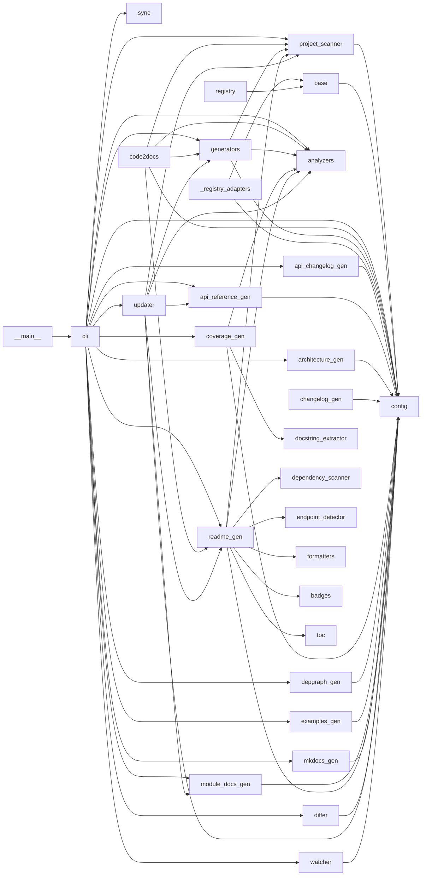

# code2docs — Dependency Graph

> 31 modules, 59 dependency edges

## Module Dependencies

## Coupling Matrix

| | __main__ | analyzers | dependency_scanner | docstring_extractor | endpoint_detector | project_scanner | base | cli | code2docs | config | formatters | badges | markdown | toc | generators | _registry_adapters | api_changelog_gen | api_reference_gen | architecture_gen | changelog_gen | coverage_gen | depgraph_gen | examples_gen | mkdocs_gen | module_docs_gen | readme_gen | registry | sync | differ | updater | watcher |
| --- | --- | --- | --- | --- | --- | --- | --- | --- | --- | --- | --- | --- | --- | --- | --- | --- | --- | --- | --- | --- | --- | --- | --- | --- | --- | --- | --- | --- | --- | --- | --- |
| **__main__** | · |  |  |  |  |  |  | → |  |  |  |  |  |  |  |  |  |  |  |  |  |  |  |  |  |  |  |  |  |  |  |
| **analyzers** |  | · |  |  |  |  |  |  |  |  |  |  |  |  |  |  |  |  |  |  |  |  |  |  |  |  |  |  |  |  |  |
| **dependency_scanner** |  |  | · |  |  |  |  |  |  |  |  |  |  |  |  |  |  |  |  |  |  |  |  |  |  |  |  |  |  |  |  |
| **docstring_extractor** |  |  |  | · |  |  |  |  |  |  |  |  |  |  |  |  |  |  |  |  |  |  |  |  |  |  |  |  |  |  |  |
| **endpoint_detector** |  |  |  |  | · |  |  |  |  |  |  |  |  |  |  |  |  |  |  |  |  |  |  |  |  |  |  |  |  |  |  |
| **project_scanner** |  |  |  |  |  | · |  |  |  | → |  |  |  |  |  |  |  |  |  |  |  |  |  |  |  |  |  |  |  |  |  |
| **base** |  |  |  |  |  |  | · |  |  | → |  |  |  |  |  |  |  |  |  |  |  |  |  |  |  |  |  |  |  |  |  |
| **cli** |  | → |  |  |  | → |  | · |  | → |  |  |  |  | → |  | → | → | → |  | → | → | → | → | → | → |  | → | → | → | → |
| **code2docs** |  | → |  |  |  | → |  |  | · | → |  |  |  |  | → |  |  |  |  |  |  |  |  |  |  | → |  |  |  |  |  |
| **config** |  |  |  |  |  |  |  |  |  | · |  |  |  |  |  |  |  |  |  |  |  |  |  |  |  |  |  |  |  |  |  |
| **formatters** |  |  |  |  |  |  |  |  |  |  | · |  |  |  |  |  |  |  |  |  |  |  |  |  |  |  |  |  |  |  |  |
| **badges** |  |  |  |  |  |  |  |  |  |  |  | · |  |  |  |  |  |  |  |  |  |  |  |  |  |  |  |  |  |  |  |
| **markdown** |  |  |  |  |  |  |  |  |  |  |  |  | · |  |  |  |  |  |  |  |  |  |  |  |  |  |  |  |  |  |  |
| **toc** |  |  |  |  |  |  |  |  |  |  |  |  |  | · |  |  |  |  |  |  |  |  |  |  |  |  |  |  |  |  |  |
| **generators** |  | → |  |  |  | → |  |  |  | → |  |  |  |  | · |  |  |  |  |  |  |  |  |  |  |  |  |  |  |  |  |
| **_registry_adapters** |  |  |  |  |  |  | → |  |  | → |  |  |  |  |  | · |  |  |  |  |  |  |  |  |  |  |  |  |  |  |  |
| **api_changelog_gen** |  |  |  |  |  |  |  |  |  | → |  |  |  |  |  |  | · |  |  |  |  |  |  |  |  |  |  |  |  |  |  |
| **api_reference_gen** |  |  |  |  |  |  |  |  |  | → |  |  |  |  |  |  |  | · |  |  |  |  |  |  |  |  |  |  |  |  |  |
| **architecture_gen** |  |  |  |  |  |  |  |  |  | → |  |  |  |  |  |  |  |  | · |  |  |  |  |  |  |  |  |  |  |  |  |
| **changelog_gen** |  |  |  |  |  |  |  |  |  | → |  |  |  |  |  |  |  |  |  | · |  |  |  |  |  |  |  |  |  |  |  |
| **coverage_gen** |  | → |  | → |  |  |  |  |  | → |  |  |  |  |  |  |  |  |  |  | · |  |  |  |  |  |  |  |  |  |  |
| **depgraph_gen** |  |  |  |  |  |  |  |  |  | → |  |  |  |  |  |  |  |  |  |  |  | · |  |  |  |  |  |  |  |  |  |
| **examples_gen** |  |  |  |  |  |  |  |  |  | → |  |  |  |  |  |  |  |  |  |  |  |  | · |  |  |  |  |  |  |  |  |
| **mkdocs_gen** |  |  |  |  |  |  |  |  |  | → |  |  |  |  |  |  |  |  |  |  |  |  |  | · |  |  |  |  |  |  |  |
| **module_docs_gen** |  |  |  |  |  |  |  |  |  | → |  |  |  |  |  |  |  |  |  |  |  |  |  |  | · |  |  |  |  |  |  |
| **readme_gen** |  | → | → |  | → | → |  |  |  | → | → | → |  | → |  |  |  |  |  |  |  |  |  |  |  | · |  |  |  |  |  |
| **registry** |  |  |  |  |  |  | → |  |  |  |  |  |  |  |  |  |  |  |  |  |  |  |  |  |  |  | · |  |  |  |  |
| **sync** |  |  |  |  |  |  |  |  |  |  |  |  |  |  |  |  |  |  |  |  |  |  |  |  |  |  |  | · |  |  |  |
| **differ** |  |  |  |  |  |  |  |  |  | → |  |  |  |  |  |  |  |  |  |  |  |  |  |  |  |  |  |  | · |  |  |
| **updater** |  | → |  |  |  | → |  |  |  | → |  |  |  |  | → |  |  | → |  |  |  |  |  |  | → | → |  |  |  | · |  |
| **watcher** |  |  |  |  |  |  |  |  |  | → |  |  |  |  |  |  |  |  |  |  |  |  |  |  |  |  |  |  |  |  | · |

## Fan-in / Fan-out

| Module | Fan-in | Fan-out |
|--------|--------|---------|
| `__main__` | 0 | 1 |
| `analyzers` | 6 | 0 |
| `analyzers.dependency_scanner` | 1 | 0 |
| `analyzers.docstring_extractor` | 1 | 0 |
| `analyzers.endpoint_detector` | 1 | 0 |
| `analyzers.project_scanner` | 5 | 1 |
| `base` | 2 | 1 |
| `cli` | 1 | 17 |
| `code2docs` | 0 | 5 |
| `config` | 19 | 0 |
| `formatters` | 1 | 0 |
| `formatters.badges` | 1 | 0 |
| `formatters.markdown` | 0 | 0 |
| `formatters.toc` | 1 | 0 |
| `generators` | 3 | 3 |
| `generators._registry_adapters` | 0 | 2 |
| `generators.api_changelog_gen` | 1 | 1 |
| `generators.api_reference_gen` | 2 | 1 |
| `generators.architecture_gen` | 1 | 1 |
| `generators.changelog_gen` | 0 | 1 |
| `generators.coverage_gen` | 1 | 3 |
| `generators.depgraph_gen` | 1 | 1 |
| `generators.examples_gen` | 1 | 1 |
| `generators.mkdocs_gen` | 1 | 1 |
| `generators.module_docs_gen` | 2 | 1 |
| `generators.readme_gen` | 3 | 8 |
| `registry` | 0 | 1 |
| `sync` | 1 | 0 |
| `sync.differ` | 1 | 1 |
| `sync.updater` | 1 | 7 |
| `sync.watcher` | 1 | 1 |
