# System Architecture Analysis

## Overview

- **Project**: /home/tom/github/wronai/code2docs/code2docs
- **Analysis Mode**: static
- **Total Functions**: 252
- **Total Classes**: 56
- **Modules**: 40
- **Entry Points**: 238

## Architecture by Module

### generators._registry_adapters
- **Functions**: 28
- **Classes**: 14
- **File**: `_registry_adapters.py`

### generators.readme_gen
- **Functions**: 18
- **Classes**: 1
- **File**: `readme_gen.py`

### generators.examples_gen
- **Functions**: 15
- **Classes**: 1
- **File**: `examples_gen.py`

### cli
- **Functions**: 14
- **Classes**: 1
- **File**: `cli.py`

### formatters.markdown
- **Functions**: 13
- **Classes**: 1
- **File**: `markdown.py`

### generators.org_readme_gen
- **Functions**: 10
- **Classes**: 1
- **File**: `org_readme_gen.py`

### generators.architecture_gen
- **Functions**: 10
- **Classes**: 1
- **File**: `architecture_gen.py`

### analyzers.docstring_extractor
- **Functions**: 10
- **Classes**: 2
- **File**: `docstring_extractor.py`

### generators.depgraph_gen
- **Functions**: 9
- **Classes**: 1
- **File**: `depgraph_gen.py`

### generators.module_docs_gen
- **Functions**: 9
- **Classes**: 1
- **File**: `module_docs_gen.py`

### generators.api_changelog_gen
- **Functions**: 9
- **Classes**: 2
- **File**: `api_changelog_gen.py`

### generators.getting_started_gen
- **Functions**: 8
- **Classes**: 1
- **File**: `getting_started_gen.py`

### generators.contributing_gen
- **Functions**: 8
- **Classes**: 1
- **File**: `contributing_gen.py`

### llm_helper
- **Functions**: 7
- **Classes**: 1
- **File**: `llm_helper.py`

### sync.differ
- **Functions**: 7
- **Classes**: 2
- **File**: `differ.py`

### generators.coverage_gen
- **Functions**: 7
- **Classes**: 1
- **File**: `coverage_gen.py`

### generators.api_reference_gen
- **Functions**: 7
- **Classes**: 1
- **File**: `api_reference_gen.py`

### analyzers.dependency_scanner
- **Functions**: 7
- **Classes**: 3
- **File**: `dependency_scanner.py`

### generators._source_links
- **Functions**: 6
- **Classes**: 1
- **File**: `_source_links.py`

### generators.changelog_gen
- **Functions**: 6
- **Classes**: 2
- **File**: `changelog_gen.py`

## Key Entry Points

Main execution flows into the system:

### generators.examples_gen.ExamplesGenerator._generate_advanced
> Generate advanced_usage.py — individual generator usage, sync, etc.
- **Calls**: self._find_generator_classes, self._find_class_by_name, lines.append, None.join, lines.append, lines.append, lines.append, lines.append

### generators.examples_gen.ExamplesGenerator._generate_quickstart
> Generate quickstart.py — minimal working example.
- **Calls**: self._find_convenience_functions, self._find_api_classes, set, lines.extend, lines.append, self._find_class_by_name, lines.append, lines.append

### config.Code2DocsConfig.from_yaml
> Load configuration from code2docs.yaml.
- **Calls**: Path, cls, data.get, project.get, project.get, project.get, project.get, project.get

### generators.architecture_gen.ArchitectureGenerator.generate
> Generate architecture documentation.
- **Calls**: lines.append, self._generate_llm_summary, lines.append, self._detect_layers, lines.append, lines.append, lines.append, lines.append

### generators.api_reference_gen.ApiReferenceGenerator._render_module_section
> Render a module as a subsection within the consolidated doc.
- **Calls**: self._linker.file_link, None.join, lines.append, lines.append, sorted, lines.append, sorted, lines.append

### generators.readme_gen.ReadmeGenerator._extract_project_metadata
> Extract project metadata (author, license, version) from pyproject.toml or git.
- **Calls**: Path, Path, license_path.exists, pyproject_path.exists, subprocess.run, subprocess.run, subprocess.run, Path

### generators.module_docs_gen.ModuleDocsGenerator._render_module_detail
> Render a single module's detail section.
- **Calls**: self._linker.file_link, self._get_module_docstring, None.join, lines.append, sorted, sorted, lines.append, self.result.classes.items

### generators.module_docs_gen.ModuleDocsGenerator.generate
> Generate a single modules.md with all modules grouped by package.
- **Calls**: lines.append, lines.append, lines.append, sorted, lines.append, self._group_modules, groups.items, None.join

### generators.api_changelog_gen.ApiChangelogGenerator._diff_classes
> Diff class definitions.
- **Calls**: set, set, old.get, new.get, old.keys, new.keys, changes.append, ApiChange

### generators.org_readme_gen.OrgReadmeGenerator._extract_description
> Extract short description from project (max 5 lines).
- **Calls**: result.modules.values, readme.exists, pyproject.exists, hasattr, self._truncate_description, readme.read_text, content.split, enumerate

### generators.readme_gen.ReadmeGenerator._build_context
> Build template context from analysis result.
- **Calls**: DependencyScanner, dep_scanner.scan, EndpointDetector, endpoint_detector.detect, self._calc_avg_complexity, self._build_module_tree, self._generate_description, self._extract_project_metadata

### generators.api_reference_gen.ApiReferenceGenerator.generate
> Generate a single api.md with all public API grouped by package.
- **Calls**: len, len, self._group_modules, lines.append, groups.items, lines.append, groups.items, None.join

### sync.updater.Updater.apply
> Regenerate documentation for changed modules.
- **Calls**: None.resolve, ProjectScanner, scanner.analyze, ReadmeGenerator, readme_gen.generate, readme_gen.write, docs_dir.mkdir, Differ

### generators.architecture_gen.ArchitectureGenerator._generate_metrics_table
> Generate metrics summary table.
- **Calls**: stats.get, lines.append, None.join, f.complexity.get, round, lines.append, lines.append, f.complexity.get

### generators.code2llm_gen.Code2LlmGenerator._run_code2llm
> Execute code2llm CLI with appropriate options.
- **Calls**: generators.code2llm_gen.parse_gitignore, subprocess.run, str, None.join, str, str, cmd.append, cmd.append

### analyzers.dependency_scanner.DependencyScanner._parse_pyproject
> Parse pyproject.toml for dependencies.
- **Calls**: ProjectDependencies, data.get, project.get, project.get, project.get, project.get, project.get, project.get

### sync.differ.Differ.detect_changes
> Compare current file hashes with saved state. Return list of changes.
- **Calls**: None.resolve, self._load_state, self._compute_state, new_state.items, old_state.items, old_state.get, Path, changes.append

### generators.config_docs_gen.ConfigDocsGenerator._render_section
> Render a dataclass as a Markdown table.
- **Calls**: fields, None.join, getattr, type_str.replace, isinstance, self._FIELD_DOCS.get, lines.append, str

### generators.architecture_gen.ArchitectureGenerator._generate_class_diagram
> Generate Mermaid class diagram for key classes.
- **Calls**: lines.append, None.join, sorted, lines.append, lines.append, self.result.classes.values, len, lines.append

### generators.getting_started_gen.GettingStartedGenerator._render_first_usage
> Render first usage example — CLI + Python API.
- **Calls**: public_funcs.sort, lines.append, None.join, None.join, lines.append, lines.append, lines.append, lines.append

### generators.generate_docs
> High-level function to generate all documentation.
- **Calls**: ProjectScanner, scanner.analyze, None.generate, None.generate, None.generate, Code2DocsConfig, None.generate, None.generate

### cli.generate
> Generate documentation (default command).
- **Calls**: main.command, click.argument, click.option, click.option, click.option, click.option, click.option, click.option

### generators.org_readme_gen.OrgReadmeGenerator._get_repo_url
> Get repository URL from git or pyproject.toml.
- **Calls**: pyproject.exists, subprocess.run, result.stdout.strip, url.startswith, url.removesuffix, open, tomllib.load, None.get

### generators.contributing_gen.ContributingGenerator._render_code_style
> Render code style guidelines.
- **Calls**: tools.get, tools.get, tools.get, tools.get, tools.get, None.join, lines.append, lines.append

### generators.readme_gen.ReadmeGenerator._build_api_section
> Build API overview section with classes and functions.
- **Calls**: parts.append, parts.append, None.join, list, parts.append, list, None.join, parts.append

### generators.api_changelog_gen.ApiChangelogGenerator._diff_functions
> Diff function signatures.
- **Calls**: set, set, old.get, new.get, old.keys, new.keys, None.get, changes.append

### generators.architecture_gen.ArchitectureGenerator._generate_layer_diagram
> Generate Mermaid layer diagram.
- **Calls**: enumerate, range, lines.append, None.join, layers.items, None.replace, len, lines.append

### generators.depgraph_gen.DepGraphGenerator._render_matrix
> Render a coupling matrix as a Markdown table.
- **Calls**: sorted, set, None.join, self.result.modules.keys, rows.append, m.split, None.join, None.join

### generators.config_docs_gen.ConfigDocsGenerator.generate
> Generate configuration.md content.
- **Calls**: fields, lines.append, lines.append, None.join, self._render_section, getattr, hasattr, self._render_example

### generators.api_changelog_gen.ApiChangelogGenerator._render
> Render changelog as Markdown.
- **Calls**: lines.append, None.join, lines.append, None.join, lines.append, None.join, lines.append, lines.append

## Process Flows

Key execution flows identified:

### Flow 1: _generate_advanced
```
_generate_advanced [generators.examples_gen.ExamplesGenerator]
```

### Flow 2: _generate_quickstart
```
_generate_quickstart [generators.examples_gen.ExamplesGenerator]
```

### Flow 3: from_yaml
```
from_yaml [config.Code2DocsConfig]
```

### Flow 4: generate
```
generate [generators.architecture_gen.ArchitectureGenerator]
```

### Flow 5: _render_module_section
```
_render_module_section [generators.api_reference_gen.ApiReferenceGenerator]
```

### Flow 6: _extract_project_metadata
```
_extract_project_metadata [generators.readme_gen.ReadmeGenerator]
```

### Flow 7: _render_module_detail
```
_render_module_detail [generators.module_docs_gen.ModuleDocsGenerator]
```

### Flow 8: _diff_classes
```
_diff_classes [generators.api_changelog_gen.ApiChangelogGenerator]
```

### Flow 9: _extract_description
```
_extract_description [generators.org_readme_gen.OrgReadmeGenerator]
```

### Flow 10: _build_context
```
_build_context [generators.readme_gen.ReadmeGenerator]
```

## Key Classes

### generators.readme_gen.ReadmeGenerator
> Generate README.md from AnalysisResult.
- **Methods**: 17
- **Key Methods**: generators.readme_gen.ReadmeGenerator.__init__, generators.readme_gen.ReadmeGenerator.generate, generators.readme_gen.ReadmeGenerator._build_context, generators.readme_gen.ReadmeGenerator._calc_avg_complexity, generators.readme_gen.ReadmeGenerator._build_module_tree, generators.readme_gen.ReadmeGenerator._generate_description, generators.readme_gen.ReadmeGenerator._extract_project_description, generators.readme_gen.ReadmeGenerator._extract_project_metadata, generators.readme_gen.ReadmeGenerator._extract_extras, generators.readme_gen.ReadmeGenerator._build_manual

### generators.examples_gen.ExamplesGenerator
> Generate examples/ — usage examples from public API signatures.
- **Methods**: 15
- **Key Methods**: generators.examples_gen.ExamplesGenerator.__init__, generators.examples_gen.ExamplesGenerator._get_example_value, generators.examples_gen.ExamplesGenerator.generate_all, generators.examples_gen.ExamplesGenerator._generate_quickstart, generators.examples_gen.ExamplesGenerator._generate_advanced, generators.examples_gen.ExamplesGenerator._detect_package_name, generators.examples_gen.ExamplesGenerator._find_convenience_functions, generators.examples_gen.ExamplesGenerator._find_api_classes, generators.examples_gen.ExamplesGenerator._find_generator_classes, generators.examples_gen.ExamplesGenerator._find_function_by_name

### formatters.markdown.MarkdownFormatter
> Helper for constructing Markdown documents.
- **Methods**: 13
- **Key Methods**: formatters.markdown.MarkdownFormatter.__init__, formatters.markdown.MarkdownFormatter.heading, formatters.markdown.MarkdownFormatter.paragraph, formatters.markdown.MarkdownFormatter.blockquote, formatters.markdown.MarkdownFormatter.code_block, formatters.markdown.MarkdownFormatter.inline_code, formatters.markdown.MarkdownFormatter.bold, formatters.markdown.MarkdownFormatter.link, formatters.markdown.MarkdownFormatter.list_item, formatters.markdown.MarkdownFormatter.table

### generators.org_readme_gen.OrgReadmeGenerator
> Generate organization README with list of projects and brief descriptions.
- **Methods**: 10
- **Key Methods**: generators.org_readme_gen.OrgReadmeGenerator.__init__, generators.org_readme_gen.OrgReadmeGenerator.generate, generators.org_readme_gen.OrgReadmeGenerator._discover_projects, generators.org_readme_gen.OrgReadmeGenerator._analyze_project, generators.org_readme_gen.OrgReadmeGenerator._extract_description, generators.org_readme_gen.OrgReadmeGenerator._truncate_description, generators.org_readme_gen.OrgReadmeGenerator._get_version, generators.org_readme_gen.OrgReadmeGenerator._get_repo_url, generators.org_readme_gen.OrgReadmeGenerator._render_project_section, generators.org_readme_gen.OrgReadmeGenerator.write

### generators.architecture_gen.ArchitectureGenerator
> Generate docs/architecture.md — architecture overview with diagrams.
- **Methods**: 10
- **Key Methods**: generators.architecture_gen.ArchitectureGenerator.__init__, generators.architecture_gen.ArchitectureGenerator.generate, generators.architecture_gen.ArchitectureGenerator._generate_pipeline_overview, generators.architecture_gen.ArchitectureGenerator._generate_layer_diagram, generators.architecture_gen.ArchitectureGenerator._get_public_entry_points, generators.architecture_gen.ArchitectureGenerator._generate_llm_summary, generators.architecture_gen.ArchitectureGenerator._generate_module_graph, generators.architecture_gen.ArchitectureGenerator._generate_class_diagram, generators.architecture_gen.ArchitectureGenerator._detect_layers, generators.architecture_gen.ArchitectureGenerator._generate_metrics_table

### analyzers.docstring_extractor.DocstringExtractor
> Extract and parse docstrings from AnalysisResult.
- **Methods**: 10
- **Key Methods**: analyzers.docstring_extractor.DocstringExtractor.extract_all, analyzers.docstring_extractor.DocstringExtractor.parse, analyzers.docstring_extractor.DocstringExtractor._extract_summary, analyzers.docstring_extractor.DocstringExtractor._classify_section, analyzers.docstring_extractor.DocstringExtractor._parse_sections, analyzers.docstring_extractor.DocstringExtractor._parse_param_line, analyzers.docstring_extractor.DocstringExtractor._parse_returns_line, analyzers.docstring_extractor.DocstringExtractor._parse_raises_line, analyzers.docstring_extractor.DocstringExtractor._parse_examples_line, analyzers.docstring_extractor.DocstringExtractor.coverage_report

### generators.depgraph_gen.DepGraphGenerator
> Generate docs/dependency-graph.md with Mermaid diagrams.
- **Methods**: 9
- **Key Methods**: generators.depgraph_gen.DepGraphGenerator.__init__, generators.depgraph_gen.DepGraphGenerator.generate, generators.depgraph_gen.DepGraphGenerator._collect_edges, generators.depgraph_gen.DepGraphGenerator._extract_imports_from_file, generators.depgraph_gen.DepGraphGenerator._import_matches, generators.depgraph_gen.DepGraphGenerator._render_mermaid, generators.depgraph_gen.DepGraphGenerator._render_matrix, generators.depgraph_gen.DepGraphGenerator._calc_degrees, generators.depgraph_gen.DepGraphGenerator._render_degree_table

### generators.module_docs_gen.ModuleDocsGenerator
> Generate docs/modules.md — consolidated module documentation.
- **Methods**: 9
- **Key Methods**: generators.module_docs_gen.ModuleDocsGenerator.__init__, generators.module_docs_gen.ModuleDocsGenerator.generate, generators.module_docs_gen.ModuleDocsGenerator._group_modules, generators.module_docs_gen.ModuleDocsGenerator._has_content, generators.module_docs_gen.ModuleDocsGenerator._render_module_detail, generators.module_docs_gen.ModuleDocsGenerator._get_public_methods, generators.module_docs_gen.ModuleDocsGenerator._count_file_lines, generators.module_docs_gen.ModuleDocsGenerator._calc_module_avg_cc, generators.module_docs_gen.ModuleDocsGenerator._get_module_docstring

### generators.api_changelog_gen.ApiChangelogGenerator
> Generate API changelog by diffing current analysis with a saved snapshot.
- **Methods**: 9
- **Key Methods**: generators.api_changelog_gen.ApiChangelogGenerator.__init__, generators.api_changelog_gen.ApiChangelogGenerator.generate, generators.api_changelog_gen.ApiChangelogGenerator.save_snapshot, generators.api_changelog_gen.ApiChangelogGenerator._build_snapshot, generators.api_changelog_gen.ApiChangelogGenerator._load_snapshot, generators.api_changelog_gen.ApiChangelogGenerator._diff, generators.api_changelog_gen.ApiChangelogGenerator._diff_functions, generators.api_changelog_gen.ApiChangelogGenerator._diff_classes, generators.api_changelog_gen.ApiChangelogGenerator._render

### generators.getting_started_gen.GettingStartedGenerator
> Generate docs/getting-started.md from entry points and dependencies.
- **Methods**: 8
- **Key Methods**: generators.getting_started_gen.GettingStartedGenerator.__init__, generators.getting_started_gen.GettingStartedGenerator.generate, generators.getting_started_gen.GettingStartedGenerator._render_prerequisites, generators.getting_started_gen.GettingStartedGenerator._render_installation, generators.getting_started_gen.GettingStartedGenerator._render_first_usage, generators.getting_started_gen.GettingStartedGenerator._generate_intro, generators.getting_started_gen.GettingStartedGenerator._render_next_steps, generators.getting_started_gen.GettingStartedGenerator._get_top_level_modules

### generators.contributing_gen.ContributingGenerator
> Generate CONTRIBUTING.md by detecting dev tools from pyproject.toml.
- **Methods**: 8
- **Key Methods**: generators.contributing_gen.ContributingGenerator.__init__, generators.contributing_gen.ContributingGenerator.generate, generators.contributing_gen.ContributingGenerator._detect_dev_tools, generators.contributing_gen.ContributingGenerator._render_setup, generators.contributing_gen.ContributingGenerator._render_development, generators.contributing_gen.ContributingGenerator._render_testing, generators.contributing_gen.ContributingGenerator._render_code_style, generators.contributing_gen.ContributingGenerator._render_pull_request

### llm_helper.LLMHelper
> Thin wrapper around litellm for documentation generation.

If LLM is unavailable or disabled, every 
- **Methods**: 7
- **Key Methods**: llm_helper.LLMHelper.__init__, llm_helper.LLMHelper.available, llm_helper.LLMHelper.complete, llm_helper.LLMHelper.generate_project_description, llm_helper.LLMHelper.generate_architecture_summary, llm_helper.LLMHelper.generate_getting_started_summary, llm_helper.LLMHelper.enhance_module_docstring

### generators.coverage_gen.CoverageGenerator
> Generate docs/coverage.md — docstring coverage report.
- **Methods**: 7
- **Key Methods**: generators.coverage_gen.CoverageGenerator.__init__, generators.coverage_gen.CoverageGenerator.generate, generators.coverage_gen.CoverageGenerator._render_summary, generators.coverage_gen.CoverageGenerator._render_per_module, generators.coverage_gen.CoverageGenerator._collect_module_stats, generators.coverage_gen.CoverageGenerator._format_coverage_table, generators.coverage_gen.CoverageGenerator._render_undocumented

### generators.api_reference_gen.ApiReferenceGenerator
> Generate docs/api.md — consolidated API reference.
- **Methods**: 7
- **Key Methods**: generators.api_reference_gen.ApiReferenceGenerator.__init__, generators.api_reference_gen.ApiReferenceGenerator.generate, generators.api_reference_gen.ApiReferenceGenerator._group_modules, generators.api_reference_gen.ApiReferenceGenerator._has_content, generators.api_reference_gen.ApiReferenceGenerator._render_module_section, generators.api_reference_gen.ApiReferenceGenerator._get_public_methods, generators.api_reference_gen.ApiReferenceGenerator._format_signature

### analyzers.dependency_scanner.DependencyScanner
> Scan and parse project dependency files.
- **Methods**: 7
- **Key Methods**: analyzers.dependency_scanner.DependencyScanner.scan, analyzers.dependency_scanner.DependencyScanner._parse_pyproject, analyzers.dependency_scanner.DependencyScanner._parse_pyproject_regex, analyzers.dependency_scanner.DependencyScanner._parse_setup_py, analyzers.dependency_scanner.DependencyScanner._parse_requirements_txt, analyzers.dependency_scanner.DependencyScanner._parse_dep_string, analyzers.dependency_scanner.DependencyScanner._detect_version

### sync.differ.Differ
> Detect changes between current source and previous state.
- **Methods**: 6
- **Key Methods**: sync.differ.Differ.__init__, sync.differ.Differ.detect_changes, sync.differ.Differ.save_state, sync.differ.Differ._load_state, sync.differ.Differ._compute_state, sync.differ.Differ._file_to_module

### generators._source_links.SourceLinker
> Build source-code links (relative paths + optional GitHub/GitLab URLs).
- **Methods**: 6
- **Key Methods**: generators._source_links.SourceLinker.__init__, generators._source_links.SourceLinker.source_link, generators._source_links.SourceLinker.file_link, generators._source_links.SourceLinker._relative_path, generators._source_links.SourceLinker._find_git_root, generators._source_links.SourceLinker._detect_branch

### generators.changelog_gen.ChangelogGenerator
> Generate CHANGELOG.md from git log and analysis diff.
- **Methods**: 6
- **Key Methods**: generators.changelog_gen.ChangelogGenerator.__init__, generators.changelog_gen.ChangelogGenerator.generate, generators.changelog_gen.ChangelogGenerator._get_git_log, generators.changelog_gen.ChangelogGenerator._classify_message, generators.changelog_gen.ChangelogGenerator._group_by_type, generators.changelog_gen.ChangelogGenerator._render

### generators.mkdocs_gen.MkDocsGenerator
> Generate mkdocs.yml from the docs/ directory structure.
- **Methods**: 5
- **Key Methods**: generators.mkdocs_gen.MkDocsGenerator.__init__, generators.mkdocs_gen.MkDocsGenerator.generate, generators.mkdocs_gen.MkDocsGenerator._read_pyproject_mkdocs, generators.mkdocs_gen.MkDocsGenerator._build_nav, generators.mkdocs_gen.MkDocsGenerator.write

### registry.GeneratorRegistry
> Registry of documentation generators.

Generators register themselves via :meth:`register`. The CLI 
- **Methods**: 4
- **Key Methods**: registry.GeneratorRegistry.__init__, registry.GeneratorRegistry.add, registry.GeneratorRegistry.run_all, registry.GeneratorRegistry.run_only

## Data Transformation Functions

Key functions that process and transform data:

### generators.coverage_gen.CoverageGenerator._format_coverage_table
> Format coverage stats as a Markdown table.
- **Output to**: None.join, lines.append

### generators.code2llm_gen.parse_gitignore
> Parse .gitignore file and return list of patterns to exclude.

Filters out:
- Empty lines
- Comments
- **Output to**: gitignore_path.exists, gitignore_path.read_text, content.split, line.strip, line.startswith

### generators.api_reference_gen.ApiReferenceGenerator._format_signature
> Format a function signature string.
- **Output to**: None.join, len

### cli.DefaultGroup.parse_args
- **Output to**: None.parse_args, super

### analyzers.endpoint_detector.EndpointDetector._parse_decorator
> Try to parse a route decorator string.
- **Output to**: self.FASTAPI_PATTERNS.search, self.FLASK_PATTERNS.search, Endpoint, Endpoint, None.upper

### analyzers.dependency_scanner.DependencyScanner._parse_pyproject
> Parse pyproject.toml for dependencies.
- **Output to**: ProjectDependencies, data.get, project.get, project.get, project.get

### analyzers.dependency_scanner.DependencyScanner._parse_pyproject_regex
> Fallback regex-based pyproject.toml parser.
- **Output to**: ProjectDependencies, path.read_text, re.search, re.search, re.findall

### analyzers.dependency_scanner.DependencyScanner._parse_setup_py
> Parse setup.py for dependencies (regex-based, no exec).
- **Output to**: ProjectDependencies, path.read_text, re.search, re.search, re.findall

### analyzers.dependency_scanner.DependencyScanner._parse_requirements_txt
> Parse requirements.txt.
- **Output to**: ProjectDependencies, None.splitlines, line.strip, deps.dependencies.append, path.read_text

### analyzers.dependency_scanner.DependencyScanner._parse_dep_string
> Parse a dependency string like 'package>=1.0'.
- **Output to**: re.match, DependencyInfo, dep_str.strip, DependencyInfo, dep_str.strip

### analyzers.docstring_extractor.DocstringExtractor.parse
> Parse a docstring into structured sections (orchestrator).
- **Output to**: None.splitlines, DocstringInfo, self._extract_summary, self._parse_sections, DocstringInfo

### analyzers.docstring_extractor.DocstringExtractor._parse_sections
> Walk remaining lines, dispatching content to the right section.
- **Output to**: None.strip, line.strip, self._classify_section, desc_lines.append, None.join

### analyzers.docstring_extractor.DocstringExtractor._parse_param_line
> Parse a single param line: 'name: description'.
- **Output to**: line.split, pdesc.strip, pname.strip

### analyzers.docstring_extractor.DocstringExtractor._parse_returns_line
> Parse a returns line.

### analyzers.docstring_extractor.DocstringExtractor._parse_raises_line
> Parse a raises line.
- **Output to**: info.raises.append

### analyzers.docstring_extractor.DocstringExtractor._parse_examples_line
> Parse an examples line.
- **Output to**: info.examples.append

## Behavioral Patterns

### recursion_analyze
- **Type**: recursion
- **Confidence**: 0.90
- **Functions**: analyzers.project_scanner.ProjectScanner.analyze

### state_machine_Differ
- **Type**: state_machine
- **Confidence**: 0.70
- **Functions**: sync.differ.Differ.__init__, sync.differ.Differ.detect_changes, sync.differ.Differ.save_state, sync.differ.Differ._load_state, sync.differ.Differ._compute_state

## Public API Surface

Functions exposed as public API (no underscore prefix):

- `config.Code2DocsConfig.from_yaml` - 53 calls
- `generators.architecture_gen.ArchitectureGenerator.generate` - 42 calls
- `sync.watcher.start_watcher` - 29 calls
- `generators.module_docs_gen.ModuleDocsGenerator.generate` - 29 calls
- `generators.api_reference_gen.ApiReferenceGenerator.generate` - 20 calls
- `sync.updater.Updater.apply` - 19 calls
- `sync.differ.Differ.detect_changes` - 16 calls
- `generators.generate_docs` - 15 calls
- `cli.generate` - 15 calls
- `generators.config_docs_gen.ConfigDocsGenerator.generate` - 12 calls
- `generators.code2llm_gen.parse_gitignore` - 11 calls
- `generators._registry_adapters.ReadmeGeneratorAdapter.run` - 11 calls
- `generators._registry_adapters.OrgReadmeAdapter.run` - 11 calls
- `formatters.toc.extract_headings` - 10 calls
- `cli.init` - 10 calls
- `generators.readme_gen.ReadmeGenerator.write` - 9 calls
- `config.LLMConfig.from_env` - 9 calls
- `formatters.markdown.MarkdownFormatter.table` - 8 calls
- `generators.depgraph_gen.DepGraphGenerator.generate` - 8 calls
- `generators.getting_started_gen.GettingStartedGenerator.generate` - 8 calls
- `generators.code2llm_gen.Code2LlmGenerator.generate_all` - 8 calls
- `generators.org_readme_gen.OrgReadmeGenerator.generate` - 8 calls
- `cli.sync` - 8 calls
- `analyzers.dependency_scanner.DependencyScanner.scan` - 8 calls
- `generators._registry_adapters.Code2LlmAdapter.run` - 7 calls
- `cli.watch` - 7 calls
- `cli.check` - 7 calls
- `generators.contributing_gen.ContributingGenerator.generate` - 7 calls
- `llm_helper.LLMHelper.complete` - 6 calls
- `generators.readme_gen.generate_readme` - 6 calls
- `generators._registry_adapters.ApiChangelogAdapter.run` - 6 calls
- `generators._registry_adapters.ExamplesAdapter.run` - 6 calls
- `cli.diff` - 6 calls
- `generators.api_changelog_gen.ApiChangelogGenerator.generate` - 6 calls
- `analyzers.docstring_extractor.DocstringExtractor.parse` - 6 calls
- `analyzers.docstring_extractor.DocstringExtractor.coverage_report` - 6 calls
- `sync.differ.Differ.save_state` - 5 calls
- `generators.readme_gen.ReadmeGenerator.generate` - 5 calls
- `generators.coverage_gen.CoverageGenerator.generate` - 5 calls
- `generators.code2llm_gen.Code2LlmGenerator.get_analysis_summary` - 5 calls

## System Interactions

How components interact:

```mermaid
graph TD
    _generate_advanced --> _find_generator_clas
    _generate_advanced --> _find_class_by_name
    _generate_advanced --> append
    _generate_advanced --> join
    _generate_quickstart --> _find_convenience_fu
    _generate_quickstart --> _find_api_classes
    _generate_quickstart --> set
    _generate_quickstart --> extend
    _generate_quickstart --> append
    from_yaml --> Path
    from_yaml --> cls
    from_yaml --> get
    generate --> append
    generate --> _generate_llm_summar
    generate --> _detect_layers
    _render_module_secti --> file_link
    _render_module_secti --> join
    _render_module_secti --> append
    _render_module_secti --> sorted
    _extract_project_met --> Path
    _extract_project_met --> exists
    _extract_project_met --> run
    _render_module_detai --> file_link
    _render_module_detai --> _get_module_docstrin
    _render_module_detai --> join
    _render_module_detai --> append
    _render_module_detai --> sorted
    generate --> sorted
    _diff_classes --> set
    _diff_classes --> get
```



## Reverse Engineering Guidelines

1. **Entry Points**: Start analysis from the entry points listed above
2. **Core Logic**: Focus on classes with many methods
3. **Data Flow**: Follow data transformation functions
4. **Process Flows**: Use the flow diagrams for execution paths
5. **API Surface**: Public API functions reveal the interface

## Context for LLM

Maintain the identified architectural patterns and public API surface when suggesting changes.