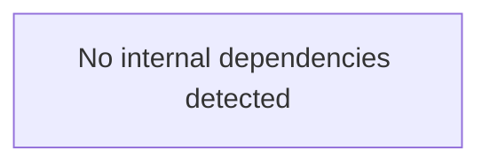

# code2docs — Architecture

> 55 modules | 298 functions | 60 classes

### Other

- `code2docs`
- `code2docs.__main__`
- `code2docs.examples.advanced_usage`
- `code2docs.examples.quickstart`
- `code2docs.generators`
- `code2docs.generators._registry_adapters`
- `code2docs.generators._source_links`
- `code2docs.generators.architecture_gen`
- `code2docs.generators.changelog_gen`
- `code2docs.generators.code2llm_gen`
- `code2docs.generators.contributing_gen`
- `code2docs.generators.coverage_gen`
- `code2docs.generators.depgraph_gen`
- `code2docs.generators.examples_gen`
- `code2docs.generators.getting_started_gen`
- `code2docs.generators.mkdocs_gen`
- `code2docs.generators.module_docs_gen`
- `code2docs.generators.org_readme_gen`
- `code2docs.generators.readme_gen`
- `code2docs.llm_helper`
- `code2docs.registry`
- `code2docs.sync`
- `code2docs.sync.differ`
- `code2docs.sync.updater`
- `code2docs.sync.watcher`
- `docs.examples.advanced_usage`
- `docs.examples.quickstart`
- `examples.04_sync_and_watch`
- `examples.05_custom_generators`
- `examples.07_web_frameworks`
- `examples.advanced_usage`
- `examples.basic_usage`
- `examples.class_examples`
- `examples.entry_points`
- `examples.quickstart`
- `project`

### Analysis

- `code2docs.analyzers`
- `code2docs.analyzers.dependency_scanner`
- `code2docs.analyzers.docstring_extractor`
- `code2docs.analyzers.endpoint_detector`
- `code2docs.analyzers.project_scanner`

### API / CLI

- `code2docs.cli`
- `code2docs.generators.api_changelog_gen`
- `code2docs.generators.api_reference_gen`
- `examples.01_cli_usage`
- `examples.03_programmatic_api`

### Config

- `code2docs.config`
- `code2docs.generators.config_docs_gen`
- `examples.02_configuration`

### Export / Output

- `code2docs.formatters`
- `code2docs.formatters.badges`
- `code2docs.formatters.markdown`
- `code2docs.formatters.toc`
- `examples.06_formatters`

## Module Dependency Graph

## Key Classes

```mermaid
classDiagram
    class ReadmeGenerator {
        -__init__(self, config, result) None
        +generate(self) None
        -_build_context(self, project_name) None
        -_calc_avg_complexity(self) None
        -_build_module_tree(self) None
        -_generate_description(self, project_name, entry_points) None
        -_extract_project_description(self, project_name) None
        -_extract_project_metadata(self) None
        ... +9 more
    }
    class ExamplesGenerator {
        -__init__(self, config, result) None
        -_get_example_value(self, arg_name) None
        +generate_all(self) None
        -_generate_quickstart(self) None
        -_generate_advanced(self) None
        -_detect_package_name(self) None
        -_find_convenience_functions(self) None
        -_find_api_classes(self) None
        ... +7 more
    }
    class MarkdownFormatter {
        -__init__(self) None
        +heading(self, text, level) None
        +paragraph(self, text) None
        +blockquote(self, text) None
        +code_block(self, code, language) None
        +inline_code(self, text) None
        +bold(self, text) None
        +link(self, text, url) None
        ... +5 more
    }
    class OrgReadmeGenerator {
        -__init__(self, config, org_path) None
        +generate(self) None
        -_discover_projects(self) None
        -_analyze_project(self, project_path) None
        -_extract_description(self, project_path, result) None
        -_truncate_description(self, desc, max_chars) None
        -_get_version(self, project_path) None
        -_get_repo_url(self, project_path) None
        ... +2 more
    }
    class ArchitectureGenerator {
        -__init__(self, config, result) None
        +generate(self) None
        -_generate_pipeline_overview(self, project_name) None
        -_generate_layer_diagram(layers) None
        -_get_public_entry_points(self) None
        -_generate_llm_summary(self, project_name) None
        -_generate_module_graph(self) None
        -_generate_class_diagram(self) None
        ... +2 more
    }
    class DocstringExtractor {
        +extract_all(self, result) None
        +parse(self, docstring) None
        -_extract_summary(lines) None
        -_classify_section(line) None
        -_parse_sections(self, lines, info) None
        -_parse_param_line(info, line) None
        -_parse_returns_line(info, line) None
        -_parse_raises_line(info, line) None
        ... +2 more
    }
    class DependencyScanner {
        +scan(self, project_path) None
        -_parse_pyproject(self, path) None
        -_parse_pyproject_regex(self, path) None
        -_parse_setup_py(self, path) None
        -_parse_requirements_txt(self, path) None
        -_parse_package_json(self, path) None
        -_parse_cargo_toml(self, path) None
        -_parse_go_mod(self, path) None
        ... +2 more
    }
    class DepGraphGenerator {
        -__init__(self, config, result) None
        +generate(self) None
        -_collect_edges(self) None
        -_extract_imports_from_file(file_path) None
        -_import_matches(imp, module) None
        -_render_mermaid(self, edges) None
        -_render_matrix(self, edges) None
        -_calc_degrees(edges) None
        ... +1 more
    }
    class ModuleDocsGenerator {
        -__init__(self, config, result) None
        +generate(self) None
        -_group_modules(self) None
        -_has_content(self, mod_name) None
        -_render_module_detail(self, mod_name, mod_info) None
        -_get_public_methods(self, cls_info) None
        -_count_file_lines(self, file_path) None
        -_calc_module_avg_cc(self, mod_name) None
        ... +1 more
    }
    class ApiChangelogGenerator {
        -__init__(self, config, result) None
        +generate(self, project_path) None
        +save_snapshot(self, project_path) None
        -_build_snapshot(self) None
        -_load_snapshot(path) None
        -_diff(self, old, new) None
        -_diff_functions(old, new, changes) None
        -_diff_classes(old, new, changes) None
        ... +1 more
    }
    class GettingStartedGenerator {
        -__init__(self, config, result) None
        +generate(self) None
        -_render_prerequisites(self) None
        -_render_installation(self) None
        -_render_first_usage(self) None
        -_generate_intro(self, project) None
        -_render_next_steps(self) None
        -_get_top_level_modules(self) None
    }
    class ContributingGenerator {
        -__init__(self, config, result) None
        +generate(self) None
        -_detect_dev_tools(self) None
        -_render_setup(self, tools) None
        -_render_development(tools) None
        -_render_testing(tools) None
        -_render_code_style(tools) None
        -_render_pull_request() None
    }
    class CoverageGenerator {
        -__init__(self, config, result) None
        +generate(self) None
        -_render_summary(report) None
        -_render_per_module(self) None
        -_collect_module_stats(self) None
        -_format_coverage_table(stats) None
        -_render_undocumented(self) None
    }
    class ApiReferenceGenerator {
        -__init__(self, config, result) None
        +generate(self) None
        -_group_modules(self) None
        -_has_content(self, mod_name) None
        -_render_module_section(self, mod_name, mod_info) None
        -_get_public_methods(self, cls_info) None
        -_format_signature(func) None
    }
    class LLMHelper {
        -__init__(self, config) None
        +code2docs.llm_helper.LLMHelper.available()
        +complete(self, prompt, system) None
        +generate_project_description(self, project_name, modules_summary) None
        +generate_architecture_summary(self, project_name, layers) None
        +generate_getting_started_summary(self, project_name, cli_commands) None
        +enhance_module_docstring(self, module_name, functions) None
    }
```

## Detected Patterns

- **recursion_analyze** (recursion) — confidence: 90%, functions: `code2docs.analyzers.project_scanner.ProjectScanner.analyze`
- **state_machine_Differ** (state_machine) — confidence: 70%, functions: `code2docs.sync.differ.Differ.__init__`, `code2docs.sync.differ.Differ.detect_changes`, `code2docs.sync.differ.Differ.save_state`, `code2docs.sync.differ.Differ._load_state`, `code2docs.sync.differ.Differ._compute_state`

## Public Entry Points

- `code2docs.generators.generate_docs` — High-level function to generate all documentation.
- `code2docs.generators.code2llm_gen.generate_code2llm_analysis` — Convenience function to generate code2llm analysis.
- `code2docs.cli.main` — code2docs — Auto-generate project documentation from source code.
- `code2docs.cli.generate` — Generate documentation (default command).
- `code2docs.cli.sync` — Synchronize documentation with source code changes.
- `code2docs.cli.watch` — Watch for file changes and auto-regenerate docs.
- `code2docs.cli.init` — Initialize code2docs.yaml configuration file.
- `code2docs.cli.check` — Health check — verify documentation completeness.
- `code2docs.cli.diff` — Preview what would change without writing anything.
- `examples.04_sync_and_watch.detect_changes_example` — Detect what files have changed since last documentation generation.
- `examples.04_sync_and_watch.update_docs_incrementally` — Update only the parts of docs that need changing.
- `examples.04_sync_and_watch.force_full_regeneration` — Force full regeneration of all documentation.
- `examples.04_sync_and_watch.watch_and_auto_regenerate` — Watch for file changes and auto-regenerate documentation.
- `examples.04_sync_and_watch.custom_watcher_with_hooks` — Set up a custom watcher with pre/post generation hooks.
- `examples.04_sync_and_watch.sync_with_git_changes` — Only regenerate docs for files changed in git.
- `examples.05_custom_generators.generate_custom_report` — Generate a custom metrics report.
- `examples.06_formatters.markdown_formatting_examples` — Demonstrate markdown formatting utilities.
- `examples.06_formatters.generate_complex_document` — Generate a complex markdown document using the formatter.
- `examples.06_formatters.badge_examples` — Generate various badge examples.
- `examples.06_formatters.toc_examples` — Demonstrate table of contents generation.
- `examples.06_formatters.build_custom_readme` — Build a custom README using formatters.
- `examples.03_programmatic_api.generate_readme_simple` — Generate README.md content from a project.
- `examples.03_programmatic_api.generate_full_documentation` — Generate complete documentation for a project.
- `examples.03_programmatic_api.custom_documentation_pipeline` — Create a custom documentation pipeline.
- `examples.03_programmatic_api.inspect_project_structure` — Inspect project structure from analysis.
- `examples.03_programmatic_api.generate_docs_if_needed` — Only generate docs if code has changed.
- `examples.07_web_frameworks.detect_flask_endpoints` — Detect Flask endpoints in a project.
- `examples.07_web_frameworks.detect_fastapi_endpoints` — Detect FastAPI endpoints in a project.
- `examples.07_web_frameworks.create_example_web_apps` — Create example Flask and FastAPI apps for testing.
- `examples.07_web_frameworks.document_web_project` — Complete workflow: detect endpoints and generate docs.
- `examples.01_cli_usage.run_cli_basic` — Run code2docs CLI programmatically.
- `examples.01_cli_usage.run_cli_with_config` — Run with custom configuration.
- `examples.02_configuration.create_basic_config` — Create a basic configuration.
- `examples.02_configuration.create_advanced_config` — Create advanced configuration with all options.
- `examples.02_configuration.save_yaml_config_example` — Save example YAML config to file.
- `examples.02_configuration.load_config_from_yaml` — Load configuration from YAML file.
- `code2docs.analyzers.project_scanner.analyze_and_document` — Convenience function: analyze a project in one call.

