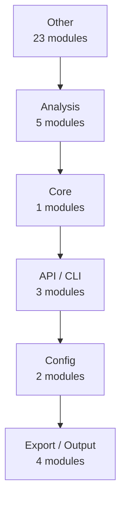
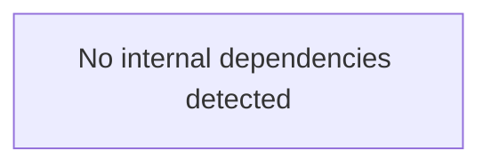

# code2docs — Architecture

> 38 modules | 229 functions | 51 classes

## How It Works

`code2docs` analyzes source code via a multi-stage pipeline:

```
Source files  ──►  code2llm (tree-sitter + AST)  ──►  AnalysisResult
                                                          │
              ┌───────────────────────────────────────────┘
              ▼
    ┌─────────────────────┐
    │   12 Generators     │
    │  ─────────────────  │
    │  README.md          │
    │  docs/api/          │
    │  docs/modules/      │
    │  docs/architecture   │
    │  docs/coverage      │
    │  examples/          │
    │  mkdocs.yml         │
    │  CONTRIBUTING.md    │
    └─────────────────────┘
```

**Analysis algorithms:**

1. **AST parsing** — language-specific parsers (tree-sitter) extract syntax trees
2. **Cyclomatic complexity** — counts independent code paths per function
3. **Fan-in / fan-out** — measures module coupling (how many modules import/are imported by each)
4. **Docstring extraction** — parses Google/NumPy/Sphinx-style docstrings into structured data
5. **Pattern detection** — identifies design patterns (Factory, Singleton, Observer, etc.)
6. **Dependency scanning** — reads pyproject.toml / requirements.txt / setup.py

## Architecture Layers



### Other

- `__main__`
- `code2docs`
- `examples.advanced_usage`
- `examples.quickstart`
- `generators`
- `generators._registry_adapters`
- `generators._source_links`
- `generators.architecture_gen`
- `generators.changelog_gen`
- `generators.contributing_gen`
- `generators.coverage_gen`
- `generators.depgraph_gen`
- `generators.examples_gen`
- `generators.getting_started_gen`
- `generators.mkdocs_gen`
- `generators.module_docs_gen`
- `generators.readme_gen`
- `llm_helper`
- `registry`
- `sync`
- `sync.differ`
- `sync.updater`
- `sync.watcher`

### Analysis

- `analyzers`
- `analyzers.dependency_scanner`
- `analyzers.docstring_extractor`
- `analyzers.endpoint_detector`
- `analyzers.project_scanner`

### Core

- `base`

### API / CLI

- `cli`
- `generators.api_changelog_gen`
- `generators.api_reference_gen`

### Config

- `config`
- `generators.config_docs_gen`

### Export / Output

- `formatters`
- `formatters.badges`
- `formatters.markdown`
- `formatters.toc`

## Module Dependency Graph



## Key Classes

```mermaid
classDiagram
    class ReadmeGenerator {
        -__init__(self, config, result) None
        +generate(self) None
        -_build_context(self, project_name) None
        -_calc_avg_complexity(self) None
        -_build_module_tree(self) None
        -_generate_description(self, project_name, entry_points) None
        -_extract_project_description(self, project_name) None
        -_extract_project_metadata(self) None
        ... +9 more
    }
    class ExamplesGenerator {
        -__init__(self, config, result) None
        +generate_all(self) None
        -_generate_quickstart(self) None
        -_generate_advanced(self) None
        -_detect_package_name(self) None
        -_find_convenience_functions(self) None
        -_find_api_classes(self) None
        -_find_generator_classes(self) None
        ... +6 more
    }
    class MarkdownFormatter {
        -__init__(self) None
        +heading(self, text, level) None
        +paragraph(self, text) None
        +blockquote(self, text) None
        +code_block(self, code, language) None
        +inline_code(self, text) None
        +bold(self, text) None
        +link(self, text, url) None
        ... +5 more
    }
    class ArchitectureGenerator {
        -__init__(self, config, result) None
        +generate(self) None
        -_generate_pipeline_overview(self, project_name) None
        -_generate_layer_diagram(layers) None
        -_get_public_entry_points(self) None
        -_generate_llm_summary(self, project_name) None
        -_generate_module_graph(self) None
        -_generate_class_diagram(self) None
        ... +2 more
    }
    class DocstringExtractor {
        +extract_all(self, result) None
        +parse(self, docstring) None
        -_extract_summary(lines) None
        -_classify_section(line) None
        -_parse_sections(self, lines, info) None
        -_parse_param_line(info, line) None
        -_parse_returns_line(info, line) None
        -_parse_raises_line(info, line) None
        ... +2 more
    }
    class DepGraphGenerator {
        -__init__(self, config, result) None
        +generate(self) None
        -_collect_edges(self) None
        -_extract_imports_from_file(file_path) None
        -_import_matches(imp, module) None
        -_render_mermaid(self, edges) None
        -_render_matrix(self, edges) None
        -_calc_degrees(edges) None
        ... +1 more
    }
    class ModuleDocsGenerator {
        -__init__(self, config, result) None
        +generate(self) None
        -_group_modules(self) None
        -_has_content(self, mod_name) None
        -_render_module_detail(self, mod_name, mod_info) None
        -_get_public_methods(self, cls_info) None
        -_count_file_lines(self, file_path) None
        -_calc_module_avg_cc(self, mod_name) None
        ... +1 more
    }
    class ApiChangelogGenerator {
        -__init__(self, config, result) None
        +generate(self, project_path) None
        +save_snapshot(self, project_path) None
        -_build_snapshot(self) None
        -_load_snapshot(path) None
        -_diff(self, old, new) None
        -_diff_functions(old, new, changes) None
        -_diff_classes(old, new, changes) None
        ... +1 more
    }
    class GettingStartedGenerator {
        -__init__(self, config, result) None
        +generate(self) None
        -_render_prerequisites(self) None
        -_render_installation(self) None
        -_render_first_usage(self) None
        -_generate_intro(self, project) None
        -_render_next_steps(self) None
        -_get_top_level_modules(self) None
    }
    class ContributingGenerator {
        -__init__(self, config, result) None
        +generate(self) None
        -_detect_dev_tools(self) None
        -_render_setup(self, tools) None
        -_render_development(tools) None
        -_render_testing(tools) None
        -_render_code_style(tools) None
        -_render_pull_request() None
    }
    class LLMHelper {
        -__init__(self, config) None
        +llm_helper.LLMHelper.available()
        +complete(self, prompt, system) None
        +generate_project_description(self, project_name, modules_summary) None
        +generate_architecture_summary(self, project_name, layers) None
        +generate_getting_started_summary(self, project_name, cli_commands) None
        +enhance_module_docstring(self, module_name, functions) None
    }
    class CoverageGenerator {
        -__init__(self, config, result) None
        +generate(self) None
        -_render_summary(report) None
        -_render_per_module(self) None
        -_collect_module_stats(self) None
        -_format_coverage_table(stats) None
        -_render_undocumented(self) None
    }
    class ApiReferenceGenerator {
        -__init__(self, config, result) None
        +generate(self) None
        -_group_modules(self) None
        -_has_content(self, mod_name) None
        -_render_module_section(self, mod_name, mod_info) None
        -_get_public_methods(self, cls_info) None
        -_format_signature(func) None
    }
    class Differ {
        -__init__(self, config) None
        +detect_changes(self, project_path) None
        +save_state(self, project_path) None
        -_load_state(self, state_path) None
        -_compute_state(self, project) None
        -_file_to_module(filepath, project) None
    }
    class SourceLinker {
        -__init__(self, config, result) None
        +source_link(self, file, line) None
        +file_link(self, file) None
        -_relative_path(self, file) None
        -_find_git_root(start) None
        -_detect_branch() None
    }
```



## Detected Patterns

- **recursion_analyze** (recursion) — confidence: 90%, functions: `analyzers.project_scanner.ProjectScanner.analyze`
- **state_machine_Differ** (state_machine) — confidence: 70%, functions: `sync.differ.Differ.__init__`, `sync.differ.Differ.detect_changes`, `sync.differ.Differ.save_state`, `sync.differ.Differ._load_state`, `sync.differ.Differ._compute_state`

## Public Entry Points

- `formatters.toc.generate_toc` — Generate a table of contents from Markdown headings.
- `generators.readme_gen.generate_readme` — Convenience function to generate a README.
- `generators.generate_docs` — High-level function to generate all documentation.
- `cli.main` — code2docs — Auto-generate project documentation from source code.
- `cli.generate` — Generate documentation (default command).
- `cli.sync` — Synchronize documentation with source code changes.
- `cli.watch` — Watch for file changes and auto-regenerate docs.
- `cli.init` — Initialize code2docs.yaml configuration file.
- `cli.check` — Health check — verify documentation completeness.
- `cli.diff` — Preview what would change without writing anything.
- `analyzers.project_scanner.analyze_and_document` — Convenience function: analyze a project in one call.

## Metrics Summary

| Metric | Value |
|--------|-------|
| Modules | 38 |
| Functions | 229 |
| Classes | 51 |
| CFG Nodes | 1346 |
| Patterns | 2 |
| Avg Complexity | 4.0 |
| Analysis Time | 1.59s |
