# code2docs — Dependency Graph

> 55 modules, 107 dependency edges

## Module Dependencies

```mermaid
graph LR
    advanced_usage --> code2docs
    advanced_usage --> analyzers
    advanced_usage --> project_scanner
    advanced_usage --> formatters
    advanced_usage --> badges
    advanced_usage --> toc
    advanced_usage --> generators
    advanced_usage --> architecture_gen
    advanced_usage --> coverage_gen
    advanced_usage --> depgraph_gen
    advanced_usage --> readme_gen
    advanced_usage --> sync
    advanced_usage --> differ
    advanced_usage --> updater
    quickstart --> code2docs
    quickstart --> analyzers
    quickstart --> project_scanner
    advanced_usage --> code2docs
    advanced_usage --> analyzers
    advanced_usage --> project_scanner
    advanced_usage --> formatters
    advanced_usage --> badges
    advanced_usage --> toc
    advanced_usage --> generators
    advanced_usage --> architecture_gen
    advanced_usage --> coverage_gen
    advanced_usage --> depgraph_gen
    advanced_usage --> readme_gen
    advanced_usage --> sync
    advanced_usage --> differ
    advanced_usage --> updater
    quickstart --> code2docs
    quickstart --> analyzers
    quickstart --> project_scanner
    02_configuration --> code2docs
    02_configuration --> config
    03_programmatic_api --> code2docs
    03_programmatic_api --> generators
    03_programmatic_api --> api_reference_gen
    03_programmatic_api --> architecture_gen
    03_programmatic_api --> changelog_gen
    03_programmatic_api --> depgraph_gen
    03_programmatic_api --> module_docs_gen
    03_programmatic_api --> readme_gen
    03_programmatic_api --> sync
    03_programmatic_api --> differ
    03_programmatic_api --> updater
    04_sync_and_watch --> code2docs
    04_sync_and_watch --> config
    04_sync_and_watch --> sync
    04_sync_and_watch --> differ
    04_sync_and_watch --> updater
    04_sync_and_watch --> watcher
    05_custom_generators --> code2docs
    05_custom_generators --> config
    05_custom_generators --> formatters
    05_custom_generators --> markdown
    05_custom_generators --> generators
    06_formatters --> code2docs
    06_formatters --> formatters
    06_formatters --> badges
    06_formatters --> markdown
    06_formatters --> toc
    07_web_frameworks --> code2docs
    07_web_frameworks --> analyzers
    07_web_frameworks --> endpoint_detector
    07_web_frameworks --> formatters
    07_web_frameworks --> markdown
    advanced_usage --> code2docs
    advanced_usage --> analyzers
    advanced_usage --> project_scanner
    advanced_usage --> formatters
    advanced_usage --> badges
    advanced_usage --> toc
    advanced_usage --> generators
    advanced_usage --> architecture_gen
    advanced_usage --> coverage_gen
    advanced_usage --> depgraph_gen
    advanced_usage --> readme_gen
    advanced_usage --> sync
    advanced_usage --> differ
    advanced_usage --> updater
    basic_usage --> code2docs
    basic_usage --> formatters
    basic_usage --> badges
    basic_usage --> toc
    basic_usage --> generators
    basic_usage --> readme_gen
    basic_usage --> sync
    basic_usage --> updater
    basic_usage --> watcher
    class_examples --> code2docs
    class_examples --> formatters
    class_examples --> markdown
    class_examples --> generators
    class_examples --> api_reference_gen
    class_examples --> examples_gen
    class_examples --> module_docs_gen
    class_examples --> readme_gen
    entry_points --> code2docs
    entry_points --> formatters
    entry_points --> markdown
    entry_points --> sync
    entry_points --> updater
    quickstart --> code2docs
    quickstart --> analyzers
    quickstart --> project_scanner
```

## Coupling Matrix

| | code2docs | __main__ | analyzers | dependency_scanner | docstring_extractor | endpoint_detector | project_scanner | base | cli | config | advanced_usage | quickstart | formatters | badges | markdown | toc | generators | _registry_adapters | _source_links | api_changelog_gen | api_reference_gen | architecture_gen | changelog_gen | code2llm_gen | config_docs_gen | contributing_gen | coverage_gen | depgraph_gen | examples_gen | getting_started_gen | mkdocs_gen | module_docs_gen | org_readme_gen | readme_gen | llm_helper | registry | sync | differ | updater | watcher | advanced_usage | quickstart | 01_cli_usage | 02_configuration | 03_programmatic_api | 04_sync_and_watch | 05_custom_generators | 06_formatters | 07_web_frameworks | advanced_usage | basic_usage | class_examples | entry_points | quickstart | project |
| --- | --- | --- | --- | --- | --- | --- | --- | --- | --- | --- | --- | --- | --- | --- | --- | --- | --- | --- | --- | --- | --- | --- | --- | --- | --- | --- | --- | --- | --- | --- | --- | --- | --- | --- | --- | --- | --- | --- | --- | --- | --- | --- | --- | --- | --- | --- | --- | --- | --- | --- | --- | --- | --- | --- | --- |
| **code2docs** | · |  |  |  |  |  |  |  |  |  |  |  |  |  |  |  |  |  |  |  |  |  |  |  |  |  |  |  |  |  |  |  |  |  |  |  |  |  |  |  |  |  |  |  |  |  |  |  |  |  |  |  |  |  |  |
| **__main__** |  | · |  |  |  |  |  |  |  |  |  |  |  |  |  |  |  |  |  |  |  |  |  |  |  |  |  |  |  |  |  |  |  |  |  |  |  |  |  |  |  |  |  |  |  |  |  |  |  |  |  |  |  |  |  |
| **analyzers** |  |  | · |  |  |  |  |  |  |  |  |  |  |  |  |  |  |  |  |  |  |  |  |  |  |  |  |  |  |  |  |  |  |  |  |  |  |  |  |  |  |  |  |  |  |  |  |  |  |  |  |  |  |  |  |
| **dependency_scanner** |  |  |  | · |  |  |  |  |  |  |  |  |  |  |  |  |  |  |  |  |  |  |  |  |  |  |  |  |  |  |  |  |  |  |  |  |  |  |  |  |  |  |  |  |  |  |  |  |  |  |  |  |  |  |  |
| **docstring_extractor** |  |  |  |  | · |  |  |  |  |  |  |  |  |  |  |  |  |  |  |  |  |  |  |  |  |  |  |  |  |  |  |  |  |  |  |  |  |  |  |  |  |  |  |  |  |  |  |  |  |  |  |  |  |  |  |
| **endpoint_detector** |  |  |  |  |  | · |  |  |  |  |  |  |  |  |  |  |  |  |  |  |  |  |  |  |  |  |  |  |  |  |  |  |  |  |  |  |  |  |  |  |  |  |  |  |  |  |  |  |  |  |  |  |  |  |  |
| **project_scanner** |  |  |  |  |  |  | · |  |  |  |  |  |  |  |  |  |  |  |  |  |  |  |  |  |  |  |  |  |  |  |  |  |  |  |  |  |  |  |  |  |  |  |  |  |  |  |  |  |  |  |  |  |  |  |  |
| **base** |  |  |  |  |  |  |  | · |  |  |  |  |  |  |  |  |  |  |  |  |  |  |  |  |  |  |  |  |  |  |  |  |  |  |  |  |  |  |  |  |  |  |  |  |  |  |  |  |  |  |  |  |  |  |  |
| **cli** |  |  |  |  |  |  |  |  | · |  |  |  |  |  |  |  |  |  |  |  |  |  |  |  |  |  |  |  |  |  |  |  |  |  |  |  |  |  |  |  |  |  |  |  |  |  |  |  |  |  |  |  |  |  |  |
| **config** |  |  |  |  |  |  |  |  |  | · |  |  |  |  |  |  |  |  |  |  |  |  |  |  |  |  |  |  |  |  |  |  |  |  |  |  |  |  |  |  |  |  |  |  |  |  |  |  |  |  |  |  |  |  |  |
| **advanced_usage** | → |  | → |  |  |  | → |  |  |  | · |  | → | → |  | → | → |  |  |  |  | → |  |  |  |  | → | → |  |  |  |  |  | → |  |  | → | → | → |  |  |  |  |  |  |  |  |  |  |  |  |  |  |  |  |
| **quickstart** | → |  | → |  |  |  | → |  |  |  |  | · |  |  |  |  |  |  |  |  |  |  |  |  |  |  |  |  |  |  |  |  |  |  |  |  |  |  |  |  |  |  |  |  |  |  |  |  |  |  |  |  |  |  |  |
| **formatters** |  |  |  |  |  |  |  |  |  |  |  |  | · |  |  |  |  |  |  |  |  |  |  |  |  |  |  |  |  |  |  |  |  |  |  |  |  |  |  |  |  |  |  |  |  |  |  |  |  |  |  |  |  |  |  |
| **badges** |  |  |  |  |  |  |  |  |  |  |  |  |  | · |  |  |  |  |  |  |  |  |  |  |  |  |  |  |  |  |  |  |  |  |  |  |  |  |  |  |  |  |  |  |  |  |  |  |  |  |  |  |  |  |  |
| **markdown** |  |  |  |  |  |  |  |  |  |  |  |  |  |  | · |  |  |  |  |  |  |  |  |  |  |  |  |  |  |  |  |  |  |  |  |  |  |  |  |  |  |  |  |  |  |  |  |  |  |  |  |  |  |  |  |
| **toc** |  |  |  |  |  |  |  |  |  |  |  |  |  |  |  | · |  |  |  |  |  |  |  |  |  |  |  |  |  |  |  |  |  |  |  |  |  |  |  |  |  |  |  |  |  |  |  |  |  |  |  |  |  |  |  |
| **generators** |  |  |  |  |  |  |  |  |  |  |  |  |  |  |  |  | · |  |  |  |  |  |  |  |  |  |  |  |  |  |  |  |  |  |  |  |  |  |  |  |  |  |  |  |  |  |  |  |  |  |  |  |  |  |  |
| **_registry_adapters** |  |  |  |  |  |  |  |  |  |  |  |  |  |  |  |  |  | · |  |  |  |  |  |  |  |  |  |  |  |  |  |  |  |  |  |  |  |  |  |  |  |  |  |  |  |  |  |  |  |  |  |  |  |  |  |
| **_source_links** |  |  |  |  |  |  |  |  |  |  |  |  |  |  |  |  |  |  | · |  |  |  |  |  |  |  |  |  |  |  |  |  |  |  |  |  |  |  |  |  |  |  |  |  |  |  |  |  |  |  |  |  |  |  |  |
| **api_changelog_gen** |  |  |  |  |  |  |  |  |  |  |  |  |  |  |  |  |  |  |  | · |  |  |  |  |  |  |  |  |  |  |  |  |  |  |  |  |  |  |  |  |  |  |  |  |  |  |  |  |  |  |  |  |  |  |  |
| **api_reference_gen** |  |  |  |  |  |  |  |  |  |  |  |  |  |  |  |  |  |  |  |  | · |  |  |  |  |  |  |  |  |  |  |  |  |  |  |  |  |  |  |  |  |  |  |  |  |  |  |  |  |  |  |  |  |  |  |
| **architecture_gen** |  |  |  |  |  |  |  |  |  |  |  |  |  |  |  |  |  |  |  |  |  | · |  |  |  |  |  |  |  |  |  |  |  |  |  |  |  |  |  |  |  |  |  |  |  |  |  |  |  |  |  |  |  |  |  |
| **changelog_gen** |  |  |  |  |  |  |  |  |  |  |  |  |  |  |  |  |  |  |  |  |  |  | · |  |  |  |  |  |  |  |  |  |  |  |  |  |  |  |  |  |  |  |  |  |  |  |  |  |  |  |  |  |  |  |  |
| **code2llm_gen** |  |  |  |  |  |  |  |  |  |  |  |  |  |  |  |  |  |  |  |  |  |  |  | · |  |  |  |  |  |  |  |  |  |  |  |  |  |  |  |  |  |  |  |  |  |  |  |  |  |  |  |  |  |  |  |
| **config_docs_gen** |  |  |  |  |  |  |  |  |  |  |  |  |  |  |  |  |  |  |  |  |  |  |  |  | · |  |  |  |  |  |  |  |  |  |  |  |  |  |  |  |  |  |  |  |  |  |  |  |  |  |  |  |  |  |  |
| **contributing_gen** |  |  |  |  |  |  |  |  |  |  |  |  |  |  |  |  |  |  |  |  |  |  |  |  |  | · |  |  |  |  |  |  |  |  |  |  |  |  |  |  |  |  |  |  |  |  |  |  |  |  |  |  |  |  |  |
| **coverage_gen** |  |  |  |  |  |  |  |  |  |  |  |  |  |  |  |  |  |  |  |  |  |  |  |  |  |  | · |  |  |  |  |  |  |  |  |  |  |  |  |  |  |  |  |  |  |  |  |  |  |  |  |  |  |  |  |
| **depgraph_gen** |  |  |  |  |  |  |  |  |  |  |  |  |  |  |  |  |  |  |  |  |  |  |  |  |  |  |  | · |  |  |  |  |  |  |  |  |  |  |  |  |  |  |  |  |  |  |  |  |  |  |  |  |  |  |  |
| **examples_gen** |  |  |  |  |  |  |  |  |  |  |  |  |  |  |  |  |  |  |  |  |  |  |  |  |  |  |  |  | · |  |  |  |  |  |  |  |  |  |  |  |  |  |  |  |  |  |  |  |  |  |  |  |  |  |  |
| **getting_started_gen** |  |  |  |  |  |  |  |  |  |  |  |  |  |  |  |  |  |  |  |  |  |  |  |  |  |  |  |  |  | · |  |  |  |  |  |  |  |  |  |  |  |  |  |  |  |  |  |  |  |  |  |  |  |  |  |
| **mkdocs_gen** |  |  |  |  |  |  |  |  |  |  |  |  |  |  |  |  |  |  |  |  |  |  |  |  |  |  |  |  |  |  | · |  |  |  |  |  |  |  |  |  |  |  |  |  |  |  |  |  |  |  |  |  |  |  |  |
| **module_docs_gen** |  |  |  |  |  |  |  |  |  |  |  |  |  |  |  |  |  |  |  |  |  |  |  |  |  |  |  |  |  |  |  | · |  |  |  |  |  |  |  |  |  |  |  |  |  |  |  |  |  |  |  |  |  |  |  |
| **org_readme_gen** |  |  |  |  |  |  |  |  |  |  |  |  |  |  |  |  |  |  |  |  |  |  |  |  |  |  |  |  |  |  |  |  | · |  |  |  |  |  |  |  |  |  |  |  |  |  |  |  |  |  |  |  |  |  |  |
| **readme_gen** |  |  |  |  |  |  |  |  |  |  |  |  |  |  |  |  |  |  |  |  |  |  |  |  |  |  |  |  |  |  |  |  |  | · |  |  |  |  |  |  |  |  |  |  |  |  |  |  |  |  |  |  |  |  |  |
| **llm_helper** |  |  |  |  |  |  |  |  |  |  |  |  |  |  |  |  |  |  |  |  |  |  |  |  |  |  |  |  |  |  |  |  |  |  | · |  |  |  |  |  |  |  |  |  |  |  |  |  |  |  |  |  |  |  |  |
| **registry** |  |  |  |  |  |  |  |  |  |  |  |  |  |  |  |  |  |  |  |  |  |  |  |  |  |  |  |  |  |  |  |  |  |  |  | · |  |  |  |  |  |  |  |  |  |  |  |  |  |  |  |  |  |  |  |
| **sync** |  |  |  |  |  |  |  |  |  |  |  |  |  |  |  |  |  |  |  |  |  |  |  |  |  |  |  |  |  |  |  |  |  |  |  |  | · |  |  |  |  |  |  |  |  |  |  |  |  |  |  |  |  |  |  |
| **differ** |  |  |  |  |  |  |  |  |  |  |  |  |  |  |  |  |  |  |  |  |  |  |  |  |  |  |  |  |  |  |  |  |  |  |  |  |  | · |  |  |  |  |  |  |  |  |  |  |  |  |  |  |  |  |  |
| **updater** |  |  |  |  |  |  |  |  |  |  |  |  |  |  |  |  |  |  |  |  |  |  |  |  |  |  |  |  |  |  |  |  |  |  |  |  |  |  | · |  |  |  |  |  |  |  |  |  |  |  |  |  |  |  |  |
| **watcher** |  |  |  |  |  |  |  |  |  |  |  |  |  |  |  |  |  |  |  |  |  |  |  |  |  |  |  |  |  |  |  |  |  |  |  |  |  |  |  | · |  |  |  |  |  |  |  |  |  |  |  |  |  |  |  |
| **advanced_usage** | → |  | → |  |  |  | → |  |  |  |  |  | → | → |  | → | → |  |  |  |  | → |  |  |  |  | → | → |  |  |  |  |  | → |  |  | → | → | → |  | · |  |  |  |  |  |  |  |  |  |  |  |  |  |  |
| **quickstart** | → |  | → |  |  |  | → |  |  |  |  |  |  |  |  |  |  |  |  |  |  |  |  |  |  |  |  |  |  |  |  |  |  |  |  |  |  |  |  |  |  | · |  |  |  |  |  |  |  |  |  |  |  |  |  |
| **01_cli_usage** |  |  |  |  |  |  |  |  |  |  |  |  |  |  |  |  |  |  |  |  |  |  |  |  |  |  |  |  |  |  |  |  |  |  |  |  |  |  |  |  |  |  | · |  |  |  |  |  |  |  |  |  |  |  |  |
| **02_configuration** | → |  |  |  |  |  |  |  |  | → |  |  |  |  |  |  |  |  |  |  |  |  |  |  |  |  |  |  |  |  |  |  |  |  |  |  |  |  |  |  |  |  |  | · |  |  |  |  |  |  |  |  |  |  |  |
| **03_programmatic_api** | → |  |  |  |  |  |  |  |  |  |  |  |  |  |  |  | → |  |  |  | → | → | → |  |  |  |  | → |  |  |  | → |  | → |  |  | → | → | → |  |  |  |  |  | · |  |  |  |  |  |  |  |  |  |  |
| **04_sync_and_watch** | → |  |  |  |  |  |  |  |  | → |  |  |  |  |  |  |  |  |  |  |  |  |  |  |  |  |  |  |  |  |  |  |  |  |  |  | → | → | → | → |  |  |  |  |  | · |  |  |  |  |  |  |  |  |  |
| **05_custom_generators** | → |  |  |  |  |  |  |  |  | → |  |  | → |  | → |  | → |  |  |  |  |  |  |  |  |  |  |  |  |  |  |  |  |  |  |  |  |  |  |  |  |  |  |  |  |  | · |  |  |  |  |  |  |  |  |
| **06_formatters** | → |  |  |  |  |  |  |  |  |  |  |  | → | → | → | → |  |  |  |  |  |  |  |  |  |  |  |  |  |  |  |  |  |  |  |  |  |  |  |  |  |  |  |  |  |  |  | · |  |  |  |  |  |  |  |
| **07_web_frameworks** | → |  | → |  |  | → |  |  |  |  |  |  | → |  | → |  |  |  |  |  |  |  |  |  |  |  |  |  |  |  |  |  |  |  |  |  |  |  |  |  |  |  |  |  |  |  |  |  | · |  |  |  |  |  |  |
| **advanced_usage** | → |  | → |  |  |  | → |  |  |  |  |  | → | → |  | → | → |  |  |  |  | → |  |  |  |  | → | → |  |  |  |  |  | → |  |  | → | → | → |  |  |  |  |  |  |  |  |  |  | · |  |  |  |  |  |
| **basic_usage** | → |  |  |  |  |  |  |  |  |  |  |  | → | → |  | → | → |  |  |  |  |  |  |  |  |  |  |  |  |  |  |  |  | → |  |  | → |  | → | → |  |  |  |  |  |  |  |  |  |  | · |  |  |  |  |
| **class_examples** | → |  |  |  |  |  |  |  |  |  |  |  | → |  | → |  | → |  |  |  | → |  |  |  |  |  |  |  | → |  |  | → |  | → |  |  |  |  |  |  |  |  |  |  |  |  |  |  |  |  |  | · |  |  |  |
| **entry_points** | → |  |  |  |  |  |  |  |  |  |  |  | → |  | → |  |  |  |  |  |  |  |  |  |  |  |  |  |  |  |  |  |  |  |  |  | → |  | → |  |  |  |  |  |  |  |  |  |  |  |  |  | · |  |  |
| **quickstart** | → |  | → |  |  |  | → |  |  |  |  |  |  |  |  |  |  |  |  |  |  |  |  |  |  |  |  |  |  |  |  |  |  |  |  |  |  |  |  |  |  |  |  |  |  |  |  |  |  |  |  |  |  | · |  |
| **project** |  |  |  |  |  |  |  |  |  |  |  |  |  |  |  |  |  |  |  |  |  |  |  |  |  |  |  |  |  |  |  |  |  |  |  |  |  |  |  |  |  |  |  |  |  |  |  |  |  |  |  |  |  |  | · |

## Fan-in / Fan-out

| Module | Fan-in | Fan-out |
|--------|--------|---------|
| `code2docs` | 15 | 0 |
| `code2docs.__main__` | 0 | 0 |
| `code2docs.analyzers` | 7 | 0 |
| `code2docs.analyzers.dependency_scanner` | 0 | 0 |
| `code2docs.analyzers.docstring_extractor` | 0 | 0 |
| `code2docs.analyzers.endpoint_detector` | 1 | 0 |
| `code2docs.analyzers.project_scanner` | 6 | 0 |
| `code2docs.base` | 0 | 0 |
| `code2docs.cli` | 0 | 0 |
| `code2docs.config` | 3 | 0 |
| `code2docs.examples.advanced_usage` | 0 | 14 |
| `code2docs.examples.quickstart` | 0 | 3 |
| `code2docs.formatters` | 9 | 0 |
| `code2docs.formatters.badges` | 5 | 0 |
| `code2docs.formatters.markdown` | 5 | 0 |
| `code2docs.formatters.toc` | 5 | 0 |
| `code2docs.generators` | 7 | 0 |
| `code2docs.generators._registry_adapters` | 0 | 0 |
| `code2docs.generators._source_links` | 0 | 0 |
| `code2docs.generators.api_changelog_gen` | 0 | 0 |
| `code2docs.generators.api_reference_gen` | 2 | 0 |
| `code2docs.generators.architecture_gen` | 4 | 0 |
| `code2docs.generators.changelog_gen` | 1 | 0 |
| `code2docs.generators.code2llm_gen` | 0 | 0 |
| `code2docs.generators.config_docs_gen` | 0 | 0 |
| `code2docs.generators.contributing_gen` | 0 | 0 |
| `code2docs.generators.coverage_gen` | 3 | 0 |
| `code2docs.generators.depgraph_gen` | 4 | 0 |
| `code2docs.generators.examples_gen` | 1 | 0 |
| `code2docs.generators.getting_started_gen` | 0 | 0 |
| `code2docs.generators.mkdocs_gen` | 0 | 0 |
| `code2docs.generators.module_docs_gen` | 2 | 0 |
| `code2docs.generators.org_readme_gen` | 0 | 0 |
| `code2docs.generators.readme_gen` | 6 | 0 |
| `code2docs.llm_helper` | 0 | 0 |
| `code2docs.registry` | 0 | 0 |
| `code2docs.sync` | 7 | 0 |
| `code2docs.sync.differ` | 5 | 0 |
| `code2docs.sync.updater` | 7 | 0 |
| `code2docs.sync.watcher` | 2 | 0 |
| `docs.examples.advanced_usage` | 0 | 14 |
| `docs.examples.quickstart` | 0 | 3 |
| `examples.01_cli_usage` | 0 | 0 |
| `examples.02_configuration` | 0 | 2 |
| `examples.03_programmatic_api` | 0 | 11 |
| `examples.04_sync_and_watch` | 0 | 6 |
| `examples.05_custom_generators` | 0 | 5 |
| `examples.06_formatters` | 0 | 5 |
| `examples.07_web_frameworks` | 0 | 5 |
| `examples.advanced_usage` | 0 | 14 |
| `examples.basic_usage` | 0 | 9 |
| `examples.class_examples` | 0 | 8 |
| `examples.entry_points` | 0 | 5 |
| `examples.quickstart` | 0 | 3 |
| `project` | 0 | 0 |
