# System Architecture Analysis

## Overview

- **Project**: /home/tom/github/wronai/code2docs
- **Analysis Mode**: static
- **Total Functions**: 103
- **Total Classes**: 24
- **Modules**: 24
- **Entry Points**: 94

## Architecture by Module

### code2docs.formatters.markdown
- **Functions**: 13
- **Classes**: 1
- **File**: `markdown.py`

### code2docs.generators.module_docs_gen
- **Functions**: 11
- **Classes**: 1
- **File**: `module_docs_gen.py`

### code2docs.generators.examples_gen
- **Functions**: 9
- **Classes**: 1
- **File**: `examples_gen.py`

### code2docs.cli
- **Functions**: 8
- **File**: `cli.py`

### code2docs.generators.readme_gen
- **Functions**: 8
- **Classes**: 1
- **File**: `readme_gen.py`

### code2docs.sync.differ
- **Functions**: 7
- **Classes**: 2
- **File**: `differ.py`

### code2docs.generators.api_reference_gen
- **Functions**: 7
- **Classes**: 1
- **File**: `api_reference_gen.py`

### code2docs.generators.changelog_gen
- **Functions**: 6
- **Classes**: 2
- **File**: `changelog_gen.py`

### code2docs.generators.architecture_gen
- **Functions**: 6
- **Classes**: 1
- **File**: `architecture_gen.py`

### code2docs.analyzers.dependency_scanner
- **Functions**: 6
- **Classes**: 3
- **File**: `dependency_scanner.py`

### code2docs.analyzers.project_scanner
- **Functions**: 4
- **Classes**: 1
- **File**: `project_scanner.py`

### code2docs.formatters.toc
- **Functions**: 3
- **File**: `toc.py`

### code2docs.analyzers.endpoint_detector
- **Functions**: 3
- **Classes**: 2
- **File**: `endpoint_detector.py`

### code2docs.analyzers.docstring_extractor
- **Functions**: 3
- **Classes**: 2
- **File**: `docstring_extractor.py`

### code2docs.sync.updater
- **Functions**: 2
- **Classes**: 1
- **File**: `updater.py`

### code2docs.formatters.badges
- **Functions**: 2
- **File**: `badges.py`

### code2docs.config
- **Functions**: 2
- **Classes**: 5
- **File**: `config.py`

### code2docs
- **Functions**: 1
- **File**: `__init__.py`

### code2docs.sync.watcher
- **Functions**: 1
- **File**: `watcher.py`

### code2docs.generators
- **Functions**: 1
- **File**: `__init__.py`

## Key Entry Points

Main execution flows into the system:

### code2docs.generators.module_docs_gen.ModuleDocsGenerator._generate_module
> Generate detailed documentation for a single module.
- **Calls**: lines.append, self._count_file_lines, self._calc_module_avg_cc, lines.append, self._get_module_docstring, self._get_module_classes, self._get_module_functions, self._get_module_metrics

### code2docs.generators.readme_gen.ReadmeGenerator._build_manual
> Fallback manual README builder.
- **Calls**: context.get, context.get, None.join, parts.append, parts.append, context.get, context.get, context.get

### code2docs.generators.api_reference_gen.ApiReferenceGenerator._generate_module_api
> Generate API reference for a single module.
- **Calls**: lines.append, None.join, lines.append, sorted, lines.append, sorted, lines.append, sorted

### code2docs.config.Code2DocsConfig.from_yaml
> Load configuration from code2docs.yaml.
- **Calls**: Path, cls, data.get, project.get, project.get, project.get, project.get, project.get

### code2docs.generators.architecture_gen.ArchitectureGenerator.generate
> Generate architecture documentation.
- **Calls**: lines.append, lines.append, lines.append, self._detect_layers, lines.append, lines.append, lines.append, lines.append

### code2docs.sync.updater.Updater.apply
> Regenerate documentation for changed modules.
- **Calls**: None.resolve, ProjectScanner, scanner.analyze, ReadmeGenerator, readme_gen.generate, readme_gen.write, Differ, differ.save_state

### code2docs.generators.examples_gen.ExamplesGenerator._generate_basic_usage
> Generate basic_usage.py example.
- **Calls**: set, lines.append, lines.append, lines.append, None.join, lines.append, imported.add, lines.append

### code2docs.analyzers.docstring_extractor.DocstringExtractor.parse
> Parse a docstring into structured sections.
- **Calls**: None.splitlines, DocstringInfo, None.strip, DocstringInfo, None.strip, line.strip, stripped.lower, lower.startswith

### code2docs.generators.architecture_gen.ArchitectureGenerator._generate_metrics_table
> Generate metrics summary table.
- **Calls**: stats.get, lines.append, None.join, f.complexity.get, round, lines.append, lines.append, self.result.functions.values

### code2docs.sync.differ.Differ.detect_changes
> Compare current file hashes with saved state. Return list of changes.
- **Calls**: None.resolve, self._load_state, self._compute_state, new_state.items, old_state.items, old_state.get, Path, changes.append

### code2docs.generators.examples_gen.ExamplesGenerator._generate_class_examples
> Generate examples for major classes.
- **Calls**: lines.append, lines.append, None.join, lines.append, lines.append, self._get_init_args, self._get_public_methods, lines.append

### code2docs.generators.architecture_gen.ArchitectureGenerator._generate_class_diagram
> Generate Mermaid class diagram for key classes.
- **Calls**: lines.append, None.join, sorted, lines.append, lines.append, self.result.classes.values, len, lines.append

### code2docs.cli.main
> code2docs — Auto-generate project documentation from source code.

Analyzes PROJECT_PATH using code2llm and generates human-readable documentation.
- **Calls**: click.group, click.argument, click.option, click.option, click.option, click.option, click.option, click.option

### code2docs.generators.module_docs_gen.ModuleDocsGenerator._get_module_metrics
- **Calls**: self._count_file_lines, self._calc_module_avg_cc, str, str, self.result.functions.values, str, str, len

### code2docs.analyzers.dependency_scanner.DependencyScanner._parse_pyproject
> Parse pyproject.toml for dependencies.
- **Calls**: ProjectDependencies, data.get, project.get, project.get, None.items, project.get, self._parse_pyproject_regex, open

### code2docs.generators.generate_docs
> High-level function to generate all documentation.
- **Calls**: ProjectScanner, scanner.analyze, None.generate, Code2DocsConfig, None.generate_all, None.generate_all, None.generate, ReadmeGenerator

### code2docs.generators.api_reference_gen.ApiReferenceGenerator._generate_index
> Generate API index page.
- **Calls**: sorted, self.result.modules.keys, None.replace, len, len, lines.append, None.join, len

### code2docs.generators.examples_gen.ExamplesGenerator._generate_entry_point_examples
> Generate examples based on entry points.
- **Calls**: None.join, self.result.functions.get, Path, lines.append, lines.append, None.join, lines.append, lines.append

### code2docs.generators.architecture_gen.ArchitectureGenerator._generate_module_graph
> Generate Mermaid module dependency graph.
- **Calls**: set, self.result.modules.items, sorted, lines.append, None.join, lines.append, lines.append, mod_name.split

### code2docs.cli.init
> Initialize code2docs.yaml configuration file.
- **Calls**: main.command, click.argument, click.option, None.resolve, Code2DocsConfig, config.to_yaml, click.echo, str

### code2docs.generators.changelog_gen.ChangelogGenerator._render
> Render grouped changelog to Markdown.
- **Calls**: self.CONVENTIONAL_TYPES.items, grouped.get, None.join, grouped.get, lines.append, lines.append, lines.append, lines.append

### code2docs.generators.architecture_gen.ArchitectureGenerator._detect_layers
> Detect architectural layers from module names.
- **Calls**: sorted, self.result.modules.keys, mod_name.lower, layer_keywords.items, any, None.append, layers.items, None.append

### code2docs.analyzers.endpoint_detector.EndpointDetector._scan_django_urls
> Scan urls.py files for Django URL patterns.
- **Calls**: Path, project.rglob, urls_file.read_text, self.DJANGO_URL_PATTERN.finditer, endpoints.append, Endpoint, match.group, str

### code2docs.generators.readme_gen.ReadmeGenerator._build_context
> Build template context from analysis result.
- **Calls**: DependencyScanner, dep_scanner.scan, EndpointDetector, endpoint_detector.detect, self._calc_avg_complexity, self._build_module_tree, code2docs.formatters.badges.generate_badges, self.result.functions.items

### code2docs.generators.readme_gen.ReadmeGenerator._build_module_tree
> Build text-based module tree.
- **Calls**: sorted, None.join, self.result.modules.keys, len, len, lines.append, detail.append, detail.append

### code2docs.generators.readme_gen.ReadmeGenerator.write
> Write README, respecting sync markers if existing file has them.
- **Calls**: Path, readme_path.exists, readme_path.parent.mkdir, readme_path.write_text, readme_path.read_text, re.compile, pattern.sub, re.escape

### code2docs.generators.changelog_gen.ChangelogGenerator._get_git_log
> Extract git log entries.
- **Calls**: None.splitlines, subprocess.run, line.split, result.stdout.strip, len, ChangelogEntry, entries.append, str

### code2docs.analyzers.dependency_scanner.DependencyScanner._parse_pyproject_regex
> Fallback regex-based pyproject.toml parser.
- **Calls**: ProjectDependencies, path.read_text, re.search, re.search, re.findall, py_match.group, dep_match.group, deps.dependencies.append

### code2docs.analyzers.dependency_scanner.DependencyScanner._parse_setup_py
> Parse setup.py for dependencies (regex-based, no exec).
- **Calls**: ProjectDependencies, path.read_text, re.search, re.search, re.findall, py_match.group, match.group, deps.dependencies.append

### code2docs.formatters.markdown.MarkdownFormatter.table
> Add a Markdown table.
- **Calls**: self.lines.append, self.lines.append, self.lines.append, self.lines.append, None.join, None.join, None.join, str

## Process Flows

Key execution flows identified:

### Flow 1: _generate_module
```
_generate_module [code2docs.generators.module_docs_gen.ModuleDocsGenerator]
```

### Flow 2: _build_manual
```
_build_manual [code2docs.generators.readme_gen.ReadmeGenerator]
```

### Flow 3: _generate_module_api
```
_generate_module_api [code2docs.generators.api_reference_gen.ApiReferenceGenerator]
```

### Flow 4: from_yaml
```
from_yaml [code2docs.config.Code2DocsConfig]
```

### Flow 5: generate
```
generate [code2docs.generators.architecture_gen.ArchitectureGenerator]
```

### Flow 6: apply
```
apply [code2docs.sync.updater.Updater]
```

### Flow 7: _generate_basic_usage
```
_generate_basic_usage [code2docs.generators.examples_gen.ExamplesGenerator]
```

### Flow 8: parse
```
parse [code2docs.analyzers.docstring_extractor.DocstringExtractor]
```

### Flow 9: _generate_metrics_table
```
_generate_metrics_table [code2docs.generators.architecture_gen.ArchitectureGenerator]
```

### Flow 10: detect_changes
```
detect_changes [code2docs.sync.differ.Differ]
```

## Key Classes

### code2docs.formatters.markdown.MarkdownFormatter
> Helper for constructing Markdown documents.
- **Methods**: 13
- **Key Methods**: code2docs.formatters.markdown.MarkdownFormatter.__init__, code2docs.formatters.markdown.MarkdownFormatter.heading, code2docs.formatters.markdown.MarkdownFormatter.paragraph, code2docs.formatters.markdown.MarkdownFormatter.blockquote, code2docs.formatters.markdown.MarkdownFormatter.code_block, code2docs.formatters.markdown.MarkdownFormatter.inline_code, code2docs.formatters.markdown.MarkdownFormatter.bold, code2docs.formatters.markdown.MarkdownFormatter.link, code2docs.formatters.markdown.MarkdownFormatter.list_item, code2docs.formatters.markdown.MarkdownFormatter.table

### code2docs.generators.module_docs_gen.ModuleDocsGenerator
> Generate docs/modules/ — detailed per-module documentation.
- **Methods**: 11
- **Key Methods**: code2docs.generators.module_docs_gen.ModuleDocsGenerator.__init__, code2docs.generators.module_docs_gen.ModuleDocsGenerator.generate_all, code2docs.generators.module_docs_gen.ModuleDocsGenerator._generate_module, code2docs.generators.module_docs_gen.ModuleDocsGenerator._count_file_lines, code2docs.generators.module_docs_gen.ModuleDocsGenerator._calc_module_avg_cc, code2docs.generators.module_docs_gen.ModuleDocsGenerator._get_module_docstring, code2docs.generators.module_docs_gen.ModuleDocsGenerator._get_module_classes, code2docs.generators.module_docs_gen.ModuleDocsGenerator._get_module_functions, code2docs.generators.module_docs_gen.ModuleDocsGenerator._get_class_methods, code2docs.generators.module_docs_gen.ModuleDocsGenerator._get_module_metrics

### code2docs.generators.examples_gen.ExamplesGenerator
> Generate examples/ — usage examples from public API signatures.
- **Methods**: 9
- **Key Methods**: code2docs.generators.examples_gen.ExamplesGenerator.__init__, code2docs.generators.examples_gen.ExamplesGenerator.generate_all, code2docs.generators.examples_gen.ExamplesGenerator._generate_basic_usage, code2docs.generators.examples_gen.ExamplesGenerator._generate_entry_point_examples, code2docs.generators.examples_gen.ExamplesGenerator._generate_class_examples, code2docs.generators.examples_gen.ExamplesGenerator._get_major_classes, code2docs.generators.examples_gen.ExamplesGenerator._get_init_args, code2docs.generators.examples_gen.ExamplesGenerator._get_public_methods, code2docs.generators.examples_gen.ExamplesGenerator.write_all

### code2docs.generators.readme_gen.ReadmeGenerator
> Generate README.md from AnalysisResult.
- **Methods**: 7
- **Key Methods**: code2docs.generators.readme_gen.ReadmeGenerator.__init__, code2docs.generators.readme_gen.ReadmeGenerator.generate, code2docs.generators.readme_gen.ReadmeGenerator._build_context, code2docs.generators.readme_gen.ReadmeGenerator._calc_avg_complexity, code2docs.generators.readme_gen.ReadmeGenerator._build_module_tree, code2docs.generators.readme_gen.ReadmeGenerator._build_manual, code2docs.generators.readme_gen.ReadmeGenerator.write

### code2docs.generators.api_reference_gen.ApiReferenceGenerator
> Generate docs/api/ — per-module API reference from signatures.
- **Methods**: 7
- **Key Methods**: code2docs.generators.api_reference_gen.ApiReferenceGenerator.__init__, code2docs.generators.api_reference_gen.ApiReferenceGenerator.generate_all, code2docs.generators.api_reference_gen.ApiReferenceGenerator._generate_index, code2docs.generators.api_reference_gen.ApiReferenceGenerator._generate_module_api, code2docs.generators.api_reference_gen.ApiReferenceGenerator._get_class_methods, code2docs.generators.api_reference_gen.ApiReferenceGenerator._format_signature, code2docs.generators.api_reference_gen.ApiReferenceGenerator.write_all

### code2docs.sync.differ.Differ
> Detect changes between current source and previous state.
- **Methods**: 6
- **Key Methods**: code2docs.sync.differ.Differ.__init__, code2docs.sync.differ.Differ.detect_changes, code2docs.sync.differ.Differ.save_state, code2docs.sync.differ.Differ._load_state, code2docs.sync.differ.Differ._compute_state, code2docs.sync.differ.Differ._file_to_module

### code2docs.generators.changelog_gen.ChangelogGenerator
> Generate CHANGELOG.md from git log and analysis diff.
- **Methods**: 6
- **Key Methods**: code2docs.generators.changelog_gen.ChangelogGenerator.__init__, code2docs.generators.changelog_gen.ChangelogGenerator.generate, code2docs.generators.changelog_gen.ChangelogGenerator._get_git_log, code2docs.generators.changelog_gen.ChangelogGenerator._classify_message, code2docs.generators.changelog_gen.ChangelogGenerator._group_by_type, code2docs.generators.changelog_gen.ChangelogGenerator._render

### code2docs.generators.architecture_gen.ArchitectureGenerator
> Generate docs/architecture.md — architecture overview with diagrams.
- **Methods**: 6
- **Key Methods**: code2docs.generators.architecture_gen.ArchitectureGenerator.__init__, code2docs.generators.architecture_gen.ArchitectureGenerator.generate, code2docs.generators.architecture_gen.ArchitectureGenerator._generate_module_graph, code2docs.generators.architecture_gen.ArchitectureGenerator._generate_class_diagram, code2docs.generators.architecture_gen.ArchitectureGenerator._detect_layers, code2docs.generators.architecture_gen.ArchitectureGenerator._generate_metrics_table

### code2docs.analyzers.dependency_scanner.DependencyScanner
> Scan and parse project dependency files.
- **Methods**: 6
- **Key Methods**: code2docs.analyzers.dependency_scanner.DependencyScanner.scan, code2docs.analyzers.dependency_scanner.DependencyScanner._parse_pyproject, code2docs.analyzers.dependency_scanner.DependencyScanner._parse_pyproject_regex, code2docs.analyzers.dependency_scanner.DependencyScanner._parse_setup_py, code2docs.analyzers.dependency_scanner.DependencyScanner._parse_requirements_txt, code2docs.analyzers.dependency_scanner.DependencyScanner._parse_dep_string

### code2docs.analyzers.endpoint_detector.EndpointDetector
> Detects web endpoints from decorator patterns in source code.
- **Methods**: 3
- **Key Methods**: code2docs.analyzers.endpoint_detector.EndpointDetector.detect, code2docs.analyzers.endpoint_detector.EndpointDetector._parse_decorator, code2docs.analyzers.endpoint_detector.EndpointDetector._scan_django_urls

### code2docs.analyzers.project_scanner.ProjectScanner
> Wraps code2llm's ProjectAnalyzer with code2docs-specific defaults.
- **Methods**: 3
- **Key Methods**: code2docs.analyzers.project_scanner.ProjectScanner.__init__, code2docs.analyzers.project_scanner.ProjectScanner._build_llm_config, code2docs.analyzers.project_scanner.ProjectScanner.analyze

### code2docs.analyzers.docstring_extractor.DocstringExtractor
> Extract and parse docstrings from AnalysisResult.
- **Methods**: 3
- **Key Methods**: code2docs.analyzers.docstring_extractor.DocstringExtractor.extract_all, code2docs.analyzers.docstring_extractor.DocstringExtractor.parse, code2docs.analyzers.docstring_extractor.DocstringExtractor.coverage_report

### code2docs.sync.updater.Updater
> Apply selective documentation updates based on detected changes.
- **Methods**: 2
- **Key Methods**: code2docs.sync.updater.Updater.__init__, code2docs.sync.updater.Updater.apply

### code2docs.config.Code2DocsConfig
> Main configuration for code2docs.
- **Methods**: 2
- **Key Methods**: code2docs.config.Code2DocsConfig.from_yaml, code2docs.config.Code2DocsConfig.to_yaml

### code2docs.sync.differ.ChangeInfo
> Describes a detected change.
- **Methods**: 1
- **Key Methods**: code2docs.sync.differ.ChangeInfo.__str__

### code2docs.generators.changelog_gen.ChangelogEntry
> A single changelog entry.
- **Methods**: 0

### code2docs.config.ReadmeConfig
> Configuration for README generation.
- **Methods**: 0

### code2docs.config.DocsConfig
> Configuration for docs/ generation.
- **Methods**: 0

### code2docs.config.ExamplesConfig
> Configuration for examples/ generation.
- **Methods**: 0

### code2docs.config.SyncConfig
> Configuration for synchronization.
- **Methods**: 0

## Data Transformation Functions

Key functions that process and transform data:

### code2docs.generators.api_reference_gen.ApiReferenceGenerator._format_signature
> Format a function signature string.
- **Output to**: None.join

### code2docs.analyzers.dependency_scanner.DependencyScanner._parse_pyproject
> Parse pyproject.toml for dependencies.
- **Output to**: ProjectDependencies, data.get, project.get, project.get, None.items

### code2docs.analyzers.dependency_scanner.DependencyScanner._parse_pyproject_regex
> Fallback regex-based pyproject.toml parser.
- **Output to**: ProjectDependencies, path.read_text, re.search, re.search, re.findall

### code2docs.analyzers.dependency_scanner.DependencyScanner._parse_setup_py
> Parse setup.py for dependencies (regex-based, no exec).
- **Output to**: ProjectDependencies, path.read_text, re.search, re.search, re.findall

### code2docs.analyzers.dependency_scanner.DependencyScanner._parse_requirements_txt
> Parse requirements.txt.
- **Output to**: ProjectDependencies, None.splitlines, line.strip, deps.dependencies.append, path.read_text

### code2docs.analyzers.dependency_scanner.DependencyScanner._parse_dep_string
> Parse a dependency string like 'package>=1.0'.
- **Output to**: re.match, DependencyInfo, dep_str.strip, DependencyInfo, dep_str.strip

### code2docs.analyzers.endpoint_detector.EndpointDetector._parse_decorator
> Try to parse a route decorator string.
- **Output to**: self.FASTAPI_PATTERNS.search, self.FLASK_PATTERNS.search, Endpoint, Endpoint, None.upper

### code2docs.analyzers.docstring_extractor.DocstringExtractor.parse
> Parse a docstring into structured sections.
- **Output to**: None.splitlines, DocstringInfo, None.strip, DocstringInfo, None.strip

## Behavioral Patterns

### state_machine_Differ
- **Type**: state_machine
- **Confidence**: 0.70
- **Functions**: code2docs.sync.differ.Differ.__init__, code2docs.sync.differ.Differ.detect_changes, code2docs.sync.differ.Differ.save_state, code2docs.sync.differ.Differ._load_state, code2docs.sync.differ.Differ._compute_state

## Public API Surface

Functions exposed as public API (no underscore prefix):

- `code2docs.config.Code2DocsConfig.from_yaml` - 34 calls
- `code2docs.generators.architecture_gen.ArchitectureGenerator.generate` - 32 calls
- `code2docs.sync.watcher.start_watcher` - 29 calls
- `code2docs.sync.updater.Updater.apply` - 28 calls
- `code2docs.analyzers.docstring_extractor.DocstringExtractor.parse` - 21 calls
- `code2docs.sync.differ.Differ.detect_changes` - 16 calls
- `code2docs.cli.main` - 14 calls
- `code2docs.generators.generate_docs` - 11 calls
- `code2docs.cli.init` - 10 calls
- `code2docs.formatters.toc.extract_headings` - 10 calls
- `code2docs.generators.readme_gen.ReadmeGenerator.write` - 9 calls
- `code2docs.formatters.markdown.MarkdownFormatter.table` - 8 calls
- `code2docs.cli.sync` - 8 calls
- `code2docs.analyzers.dependency_scanner.DependencyScanner.scan` - 8 calls
- `code2docs.cli.watch` - 7 calls
- `code2docs.generators.readme_gen.generate_readme` - 6 calls
- `code2docs.generators.api_reference_gen.ApiReferenceGenerator.generate_all` - 6 calls
- `code2docs.analyzers.docstring_extractor.DocstringExtractor.coverage_report` - 6 calls
- `code2docs.generators.readme_gen.ReadmeGenerator.generate` - 5 calls
- `code2docs.sync.differ.Differ.save_state` - 5 calls
- `code2docs.generators.module_docs_gen.ModuleDocsGenerator.generate_all` - 5 calls
- `code2docs.analyzers.endpoint_detector.EndpointDetector.detect` - 5 calls
- `code2docs.formatters.toc.generate_toc` - 4 calls
- `code2docs.generators.module_docs_gen.ModuleDocsGenerator.write_all` - 4 calls
- `code2docs.generators.api_reference_gen.ApiReferenceGenerator.write_all` - 4 calls
- `code2docs.generators.changelog_gen.ChangelogGenerator.generate` - 4 calls
- `code2docs.generators.examples_gen.ExamplesGenerator.generate_all` - 4 calls
- `code2docs.generators.examples_gen.ExamplesGenerator.write_all` - 4 calls
- `code2docs.analyzers.docstring_extractor.DocstringExtractor.extract_all` - 4 calls
- `code2docs.formatters.markdown.MarkdownFormatter.code_block` - 3 calls
- `code2docs.formatters.badges.generate_badges` - 3 calls
- `code2docs.config.Code2DocsConfig.to_yaml` - 2 calls
- `code2docs.analyzers.project_scanner.ProjectScanner.analyze` - 2 calls
- `code2docs.analyzers.project_scanner.analyze_and_document` - 2 calls
- `code2docs.formatters.markdown.MarkdownFormatter.heading` - 1 calls
- `code2docs.formatters.markdown.MarkdownFormatter.paragraph` - 1 calls
- `code2docs.formatters.markdown.MarkdownFormatter.blockquote` - 1 calls
- `code2docs.formatters.markdown.MarkdownFormatter.list_item` - 1 calls
- `code2docs.formatters.markdown.MarkdownFormatter.separator` - 1 calls
- `code2docs.formatters.markdown.MarkdownFormatter.blank` - 1 calls

## System Interactions

How components interact:

```mermaid
graph TD
    _generate_module --> append
    _generate_module --> _count_file_lines
    _generate_module --> _calc_module_avg_cc
    _generate_module --> _get_module_docstrin
    _build_manual --> get
    _build_manual --> join
    _build_manual --> append
    _generate_module_api --> append
    _generate_module_api --> join
    _generate_module_api --> sorted
    from_yaml --> Path
    from_yaml --> cls
    from_yaml --> get
    generate --> append
    generate --> _detect_layers
    apply --> resolve
    apply --> ProjectScanner
    apply --> analyze
    apply --> ReadmeGenerator
    apply --> generate
    _generate_basic_usag --> set
    _generate_basic_usag --> append
    _generate_basic_usag --> join
    parse --> splitlines
    parse --> DocstringInfo
    parse --> strip
    _generate_metrics_ta --> get
    _generate_metrics_ta --> append
    _generate_metrics_ta --> join
    _generate_metrics_ta --> round
```



## Reverse Engineering Guidelines

1. **Entry Points**: Start analysis from the entry points listed above
2. **Core Logic**: Focus on classes with many methods
3. **Data Flow**: Follow data transformation functions
4. **Process Flows**: Use the flow diagrams for execution paths
5. **API Surface**: Public API functions reveal the interface

## Context for LLM

Maintain the identified architectural patterns and public API surface when suggesting changes.